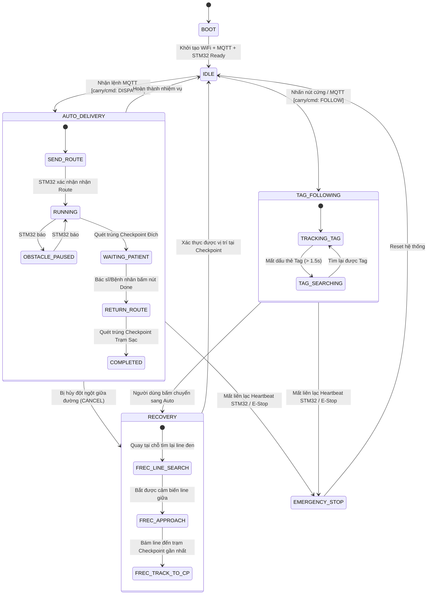
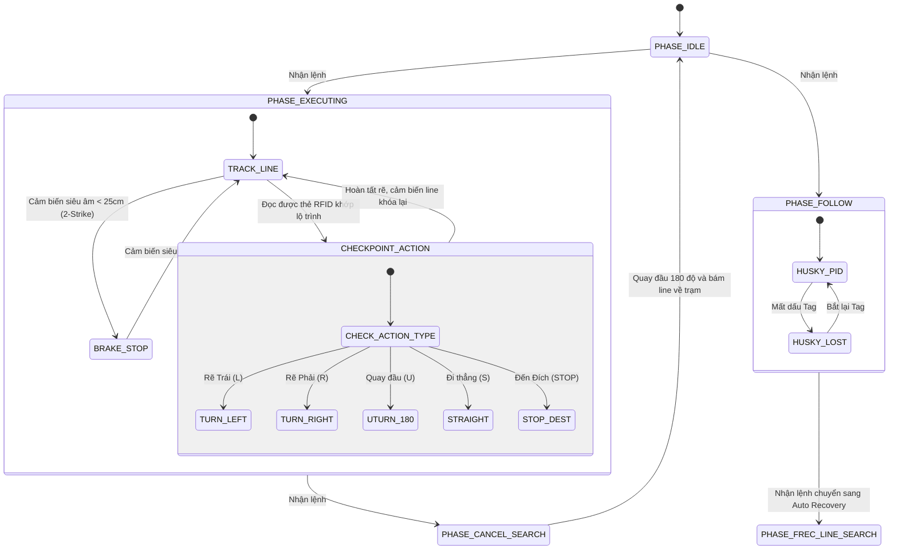

# Industrial Hospital Autonomous Guided Vehicle (AGV) & Medical Delivery System 🏥🤖

[-blue.svg)](#system-architecture)
[](#embedded-software-engineering)
[](#communication-protocols--safety)
[](#hospital-dashboard--fleet-management)

---

## 1. System Overview (Tổng quan Hệ thống)

Dự án phát triển một hệ thống **Robot Tự hành Vận chuyển Thuốc và Thiết bị Y tế (Medical AGV)** hoạt động trong môi trường bệnh viện thông minh. Hệ thống giải quyết bài toán giao phát thuốc tự động từ Kho Dược/Trạm Y tá đến 24 giường bệnh nhân, kết hợp tính năng **AI Follow-Me** (tự động bám theo bác sĩ khi đi buồng) và cơ chế khôi phục thông minh (**Auto Recovery**).

Hệ thống được thiết kế theo mô hình **3 tầng công nghiệp phân tán (Distributed 3-Tier Architecture)**:
1. **Fleet Management Dashboard:** Web App toàn diện quản lý bệnh nhân, phân công nhiệm vụ và giám sát AGV thời gian thực.
2. **Master Embedded Controller (ESP32):** Điều phối nhiệm vụ cấp cao, máy trạng thái toàn cục (FSM), kết nối mạng không dây (WiFi/MQTT), cập nhật OTA và giao diện người dùng OLED.
3. **Slave Real-Time Motion Controller (STM32F411CE BlackPill):** Lõi xử lý thời gian thực ngặt nghèo (Hard Real-Time), điều khiển kín vận tốc động cơ qua Timer PWM, giao tiếp cảm biến AI Vision (HuskyLens), đầu đọc RFID (PN532), và cảm biến siêu âm an toàn (SR05).

---

## 2. System Architecture (Cấu trúc Hệ thống)

```
+---------------------------------------------------------------------------------------+
|                              HOSPITAL DASHBOARD (FLEET TIER)                          |
|  +-------------------------------------+      +------------------------------------+  |
|  |     Frontend (React 18 + Vite)      |<---->|    Backend (Node.js / Express)     |  |
|  |     Port 5173                       | REST |    Port 3000                       |  |
|  |  - Live Bed Map (24 Giường)         |  &   |  - RESTful APIs (Bệnh nhân/Đơn)    |  |
|  |  - Telemetry Monitor                | SSE  |  - MQTT Client Service             |  |
|  |  - Mission Dispatch Control         |      |  - MongoDB Datastore (Mongoose)    |  |
|  +-------------------------------------+      +-----------------+------------------+  |
+-----------------------------------------------------------------|---------------------+
                                                                  | MQTT over WiFi 2.4GHz
                                                                  | QoS 1, KeepAlive 3s
+-----------------------------------------------------------------v---------------------+
|                      CARRY ROBOT - MASTER CONTROLLER (ESP32)                          |
|  +---------------------------------------------------------------------------------+  |
|  | - System Mode Finite State Machine (AUTO / FOLLOW / RECOVERY / EMERGENCY)       |  |
|  | - Network Manager (Auto WiFi Reconnect + Mosquitto MQTT Pub/Sub)                |  |
|  | - Hardware Watchdog & Master-Slave Heartbeat Monitor                            |  |
|  | - TelnetSpy Remote Debugger (Wireless Log Streaming)                            |  |
|  | - I2C SSD1306 OLED UI & Local Control Buttons                                   |  |
|  +----------------------------------------+----------------------------------------+  |
+-------------------------------------------|-------------------------------------------+
                                            | Full-Duplex UART (115200 bps)
                                            | Custom Frame: <CMD:PAYLOAD|CRC8>
                                            | Hardware DMA + Circular Ring Buffer
+-------------------------------------------v-------------------------------------------+
|                CARRY ROBOT - SLAVE REAL-TIME MOTION CONTROLLER (STM32F411)            |
|  +---------------------------------------------------------------------------------+  |
|  | [BSP Layer] Direct HAL/Register Driver: Clock, GPIO, Hardware TIM, SPI, UART    |  |
|  | [Motion Loop] 100Hz Closed-Loop Dual Tank-Drive Control (Hardware PWM TIM4)      |  |
|  | [Vision Subsystem] HuskyLens AI Camera (Face/Tag/Line Recognition via UART1)    |  |
|  | [Localization] PN532 RFID Reader (SPI Bus, Polling Checkpoint Tags)             |  |
|  | [Safety Subsystem] SR05 Ultrasonic with Median-of-3 + 2-Strike Verification     |  |
|  | [Link Watchdog] Emergency Brake trigger on Heartbeat Loss (>1500ms)             |  |
|  +---------------------------------------------------------------------------------+  |
+---------------------------------------------------------------------------------------+
```

---

## 3. Embedded Software Engineering (Điểm Nhấn Kỹ Thuật Nhúng)

### 3.1. Phân Tách Tác Vụ Chu Kỳ & Không Blocking (Deterministic Scheduler)
Trên vi điều khiển **STM32F411**, toàn bộ mã nguồn được kiến trúc theo mô hình **Hợp tác định thời (Cooperative Task Scheduling)** không sử dụng hàm trễ `delay()` gây treo CPU:
* **TASK 1 (10ms / 100Hz):** Vòng lặp điều khiển vận tốc động cơ và bám line (Line-tracking PD algorithm).
* **TASK 2 (15ms / 66Hz):** Quét cảm biến siêu âm SR05 kiểm tra vùng an toàn chướng ngại vật cự ly gần.
* **TASK 3 (50ms / 20Hz):** Thăm dò đầu đọc thẻ RFID PN532 để định vị mốc tọa độ trạm dừng (Checkpoints).
* **TASK 4 (Event-driven):** Giải phóng bộ đệm Circular Ring Buffer và phân tích cú pháp gói tin UART từ Master.
* **TASK 5 (1000ms / 1Hz):** Đóng gói telemetry và phát nhịp tim (Heartbeat) kèm chớp LED trạng thái PC13.

### 3.2. Chống Tràn Bộ Đệm với UART DMA & Circular Ring Buffer
Để tiếp nhận đồng thời dữ liệu streaming từ AI Camera và lệnh từ Master mà không gặp lỗi **UART Overrun Error (ORE)**:
* Cấu hình **DMA (Direct Memory Access)** ở chế độ Circular Mode trên kênh `USART2_RX`. Phần cứng tự động chuyển byte nhận được thẳng vào vùng nhớ RAM.
* Kết hợp cờ ngắt đường truyền rỗi **IDLE Line Interrupt**: CPU chỉ bị gián đoạn một lần duy nhất khi toàn bộ gói dữ liệu đã nằm trọn vẹn trong RAM, tiết kiệm hơn 85% chu kỳ CPU so với ngắt từng byte (`RXNE`).

### 3.3. Cơ chế An toàn Hệ thống & Fail-Safe Watchdog
* **Heartbeat Ping-Pong Watchdog:** ESP32 và STM32 trao đổi bản tin nhịp tim mỗi 500ms. Nếu đường truyền đứt đoạn hoặc ESP32 bị crash do sập mạng WiFi quá 1500ms, STM32 ngay lập tức kích hoạt phanh điện tử khẩn cấp (`emergencyBrake()`), cắt toàn bộ xung PWM về 0 và đưa xe vào trạng thái `EMERGENCY_STOP`.
* **Hardware Power-Cycling (Relay Cách Ly):** Hệ thống tích hợp mạch Relay điều khiển bởi GPIO để tự động ngắt/bật lại nguồn cung cấp cho module HuskyLens và PN532 khi phát hiện cảm biến bị kẹt cứng (Latch-up do nhiễu EMI động cơ).

### 3.4. Lọc Tín Hiệu Số SR05 (Median-of-3 + 2-Strike Verification)
Sóng siêu âm trong hành lang bệnh viện thường gặp hiện tượng tán xạ và dội âm đa đường (Multipath echo) tạo ra gai nhiễu tức thời:
* **Median-of-3:** Thu thập 3 mẫu liên tiếp và lấy giá trị trung vị để loại bỏ hoàn toàn các gai nhọn 0cm hoặc 400cm.
* **2-Strike Verification:** Chỉ kích hoạt phanh khi có ít nhất 2 chu kỳ đo trung vị liên tiếp đều xác nhận khoảng cách $<25$cm. Tương tự, xe chỉ lăn bánh tiếp khi có 2 lần liên tiếp đo được vùng an toàn $\ge 40$cm.

---

## 4. Communication Protocols & Packet Framing (Giao Thức Truyền Thông)

Giao thức truyền thông nhị phân giữa ESP32 và STM32 được thiết kế với cấu trúc đóng gói tin cậy cao:

```text
 +-------+------------------------+---+-------+-------+
 |   <   |  COMMAND : PAYLOAD     | | | CRC-8 |   >   |
 +-------+------------------------+---+-------+-------+
  Header   Tên lệnh : Tham số         Delimiter Mã CRC   Footer
```

* **Header (`<`) & Footer (`>`):** Đánh dấu ranh giới gói tin (Frame Delimiter).
* **Mã kiểm tra CRC-8:** Tính toán trên toàn bộ chuỗi ký tự từ sau dấu `<` đến trước dấu `|`. Đa thức sinh tiêu chuẩn: $P(x) = x^8 + x^2 + x + 1$ (`0x07`). Bất kỳ bit nào bị méo do nhiễu động cơ đều bị loại bỏ ngay lập tức.

### Bảng Lệnh Giao Tiếp Chính
| Lệnh (CMD) | Chiều truyền | Ý nghĩa | Ví dụ Payload |
| :--- | :---: | :--- | :--- |
| `ROUTE` | ESP32 $\rightarrow$ STM32 | Nạp danh sách mã trạm checkpoint | `<ROUTE:CP01,L,CP02,R,CP03,S\|4A>` |
| `FOLLOW` | ESP32 $\rightarrow$ STM32 | Bật/Tắt chế độ AI Tag Follow | `<FOLLOW:START\|1E>` / `<FOLLOW:STOP\|2B>` |
| `CANCEL` | ESP32 $\rightarrow$ STM32 | Hủy nhiệm vụ, quay đầu về trạm xuất phát | `<CANCEL:1\|3C>` |
| `CP` | STM32 $\rightarrow$ ESP32 | Báo quét trúng thẻ RFID tại trạm | `<CP:CP02\|D5>` |
| `OBSTACLE` | STM32 $\rightarrow$ ESP32 | Báo cờ vật cản (1: Có vật cản, 0: Đã thông thoáng) | `<OBSTACLE:1\|7F>` |
| `HB` | Hai chiều | Nhịp tim Telemetry (Trạng thái, Tốc độ, Khoảng cách) | `<HB:m=1,p=2,obs=0,L=120,R=120,sr=55\|8C>` |

---

## 5. State Machines (Toàn Bộ Máy Trạng Thái Hữu Hạn)

### 5.1. ESP32 Master Mode State Machine (FSM Cấp Cao)



### 5.2. STM32 Slave Motion Phase State Machine (FSM Điều Khiển Cơ Sở)



---

## 6. End-to-End Operational Workflow (Luồng Hoạt Động Chi Tiết)

```
[ Bác sĩ / Y tá tại Dashboard ]
               |
               v (Tạo đơn thuốc: Chọn Bệnh nhân & Số Giường)
[ Backend Express & MongoDB ]
               |
               v (Gửi MQTT Payload: topic carry/cmd)
[ ESP32 Master ]
               |---> Hiển thị OLED: "MISSION: BED-04"
               |---> Tra bảng Checkpoint Map: [Start -> CP01(L) -> CP02(S) -> CP04(STOP)]
               |
               v (Gửi UART Frame: <ROUTE:CP01,L,CP02,S,CP04,STOP|CRC8>)
[ STM32 Slave ]
               |---> Khởi động Timer 4 PWM (Hệ số Kp=1.8, Kd=0.6)
               |---> Bám line quang học kết hợp quét RFID
               |
        [ Gặp vật cản? ]
       /                \
   (Có: < 25cm)      (Không có vật cản)
      /                    \
[ Dừng khẩn cấp ]     [ Tiếp tục bám line ]
[ Báo <OBSTACLE:1> ]         |
      |                      v
[ Chờ thông thoáng ]  [ Quét trúng RFID CP04 ]
[ Đi tiếp ]                  |
                             v
               [ STM32 phanh dừng xe & Báo <CP:CP04|CRC8> ]
                             |
                             v
               [ ESP32 báo MQTT: ARRIVED_DESTINATION ]
                             |
               [ Y tá phát thuốc -> Bấm nút 'Hoàn thành' ]
                             |
               [ Xe tự động quay đầu 180 độ bám line về Trạm ]
```

---

## 7. Hardware Wiring & Pin Mapping (Sơ Đồ Đấu Dây)

### STM32F411CE (BlackPill)
| Ngoại vi | Chân STM32 | Chức năng | Ghi chú |
| :--- | :---: | :--- | :--- |
| **Motor L - PWM** | `PB6` | Timer 4 Channel 1 PWM | Điều khiển tốc độ bánh trái |
| **Motor L - DIR** | `PB12, PB13` | GPIO Output Logic | Hướng quay bánh trái |
| **Motor R - PWM** | `PB7` | Timer 4 Channel 2 PWM | Điều khiển tốc độ bánh phải |
| **Motor R - DIR** | `PA8, PA11` | GPIO Output Logic | Hướng quay bánh phải |
| **Cảm biến Line 3 mắt** | `PB3, PB4, PB5` | GPIO Input (Trái, Giữa, Phải) | Đọc vạch line đen phản xạ |
| **Siêu âm SR05** | `PA1 (Trig), PA0 (Echo)` | GPIO Out / In | Đo khoảng cách an toàn |
| **RFID PN532** | `PA5(SCK), PA6(MISO), PA7(MOSI), PB14(CS)` | Hardware SPI1 Bus | Quét thẻ tần số 13.56 MHz |
| **AI Camera HuskyLens** | `PA9(TX1), PA10(RX1)` | Hardware USART1 (9600 bps) | Nhận diện Tag / Người |
| **Master-Slave Link** | `PA2(TX2), PA3(RX2)` | Hardware USART2 (115200 bps) | Giao tiếp UART với ESP32 |
| **LED Trạng thái** | `PC13` | GPIO Output | Chớp Heartbeat 1Hz |

### ESP32 (Master)
| Ngoại vi | Chân ESP32 | Chức năng | Ghi chú |
| :--- | :---: | :--- | :--- |
| **UART to STM32** | `GPIO 16 (RX2), GPIO 17 (TX2)` | Hardware Serial2 | Giao tiếp gói tin với STM32 |
| **OLED Display** | `GPIO 21 (SDA), GPIO 22 (SCL)` | Hardware I2C Bus | Hiển thị trạng thái, IP, MQTT |
| **Nút bấm Mode** | `GPIO 34, GPIO 35` | Input Pullup | Chuyển chế độ Auto / Follow |
| **Relay Power Gating**| `GPIO 18` | GPIO Output | Cắt/Cấp nguồn cảm biến HuskyLens |

---

## 8. Build, Flash & Deployment Guide (Hướng Dẫn Triển Khai)

### Yêu cầu môi trường:
* [VS Code](https://code.visualstudio.com/) + Extension [PlatformIO IDE](https://platformio.org/).
* [Node.js](https://nodejs.org/) v18+ và [MongoDB](https://www.mongodb.com/).
* Mạch nạp **ST-Link v2** cho STM32 và cáp Micro-USB/Type-C cho ESP32.

### 8.1. Nạp Firmware cho Robot
```bash
# 1. Nạp Master ESP32
cd CarryRobot/carry_master
pio run --target upload

# 2. Nạp Slave STM32F411 (Sử dụng ST-Link)
cd ../carry_slave
pio run --target upload -e blackpill_f411ce
```

### 8.2. Khởi chạy Fleet Dashboard
```bash
# Chạy toàn bộ hệ thống bằng script tự động:
./start-hospital-stack.bat

# Hoặc khởi chạy thủ công:
# Terminal 1: Backend
cd "Hospital Dashboard/Backend"
npm install && npm start

# Terminal 2: Frontend
cd "Hospital Dashboard/Frontend"
npm install && npm run dev
```
Truy cập Dashboard tại: `http://localhost:5173`

---
*Tác giả: **Phan Lê Thành Nguyên** — Kỹ sư Nhúng & Tự động hóa.*
