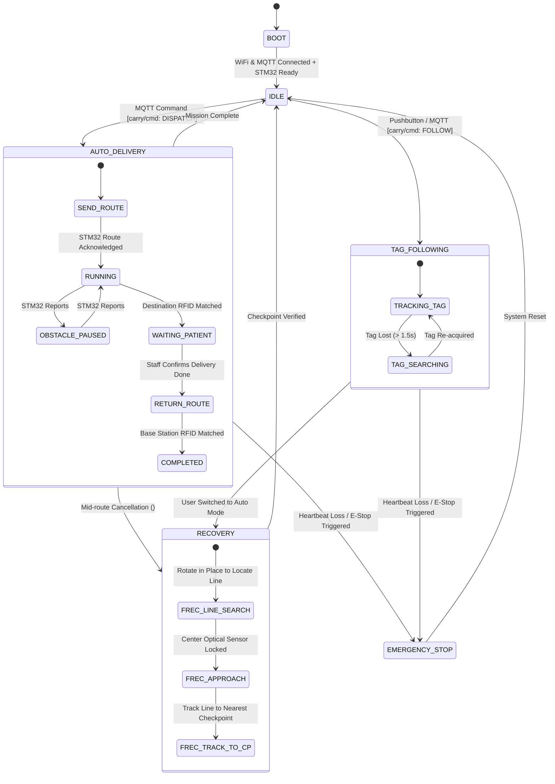
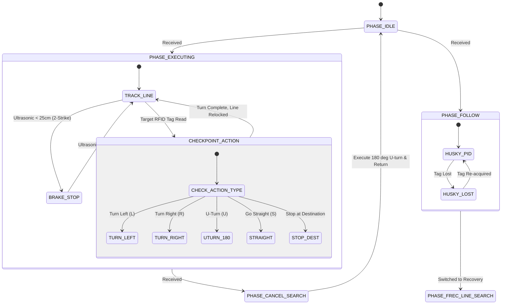

# Industrial Hospital Autonomous Guided Vehicle (AGV) & Medical Delivery System 🏥🤖

[](https://drive.google.com/drive/folders/1PlUtPB2bkTS4HJ3axmxj0etsdU3kCZiT?usp=drive_link)
[-0052CC?style=for-the-badge)](#3-system-architecture)
[](#6-embedded-software-engineering)
[](#7-communication-protocols--packet-framing)
[](#11-build-flash--deployment-guide)

---

## 📑 Table of Contents
1. [System Overview](#1-system-overview)
2. [Video Demo & Field Showcase](#2-video-demo--field-showcase)
3. [System Architecture](#3-system-architecture)
4. [Hardware Architecture & Electrical Diagram](#4-hardware-architecture--electrical-diagram)
5. [Engineering Design Decisions & Trade-offs](#5-engineering-design-decisions--trade-offs)
6. [Embedded Software Engineering](#6-embedded-software-engineering)
7. [Communication Protocols & Packet Framing](#7-communication-protocols--packet-framing)
8. [Finite State Machines](#8-finite-state-machines)
9. [End-to-End Operational Workflow](#9-end-to-end-operational-workflow)
10. [Hardware Wiring & Pin Mapping](#10-hardware-wiring--pin-mapping)
11. [Build, Flash & Deployment Guide](#11-build-flash--deployment-guide)
12. [Source Code Structure & Git Conventions](#12-source-code-structure--git-conventions)

---

## 1. System Overview

This project develops an end-to-end **Industrial Medical Autonomous Guided Vehicle (AGV)** designed for contactless prescription and equipment delivery in smart hospital environments. The system automates routine logistics from Central Pharmacy / Nurse Stations to 24 patient beds, featuring vision-based **AI Follow-Me** tracking (for doctor ward rounds) and intelligent autonomous recovery (**Auto Recovery**).

The system adopts a **Distributed 3-Tier Architecture**:
1. **Fleet Management Tier:** Full-stack web application for patient bed assignment, automated route dispatching, and real-time AGV telemetry streaming (React 18 + Node.js/Express + MongoDB + Mosquitto MQTT).
2. **Master Embedded Controller (ESP32-WROOM-32):** Handles high-level mission orchestration, global Finite State Machine (FSM), wireless connectivity (WiFi/MQTT), hardware watchdog supervision, and SSD1306 OLED interface.
3. **Slave Real-Time Motion Controller (STM32F411CE BlackPill):** Dedicated **Hard Real-Time** execution unit handling 100Hz closed-loop motor PWM control, optical line tracking, AI Camera vision parsing (HuskyLens), RFID checkpoint localization (PN532), and dual-strike ultrasonic safety braking (SR05).

---

## 2. Video Demo & Field Showcase

All physical field-testing videos (hospital floor line tracking, AI person/tag following, emergency obstacle avoidance, and mission auto-recovery) are hosted at:

🎥 **[Watch Full Video Demos & Experimental Datasets on Google Drive](https://drive.google.com/drive/folders/1PlUtPB2bkTS4HJ3axmxj0etsdU3kCZiT?usp=drive_link)**

### Demonstration Scenarios:
* 🎬 **Demo 01 - Autonomous Mission Dispatch:** Fleet dashboard dispatches medication orders; AGV autonomously navigates corridor routes, verifying milestones via RFID tags.
* 🎬 **Demo 02 - AI Follow-Me Tracking:** HuskyLens AI camera tracks doctor's ID tag/face in real time, keeping an adaptive safety follow distance.
* 🎬 **Demo 03 - Obstacle Safety & Auto-Resume:** Sub-millisecond emergency stop on pedestrian crossing ($<25\text{ cm}$), followed by smooth automated acceleration once path is clear ($\ge 40\text{ cm}$).
* 🎬 **Demo 04 - Auto Recovery & U-Turn:** Upon unexpected mission cancellation mid-transit, AGV executes an automated $180^\circ$ U-turn, relocks onto the black line, and safely returns to base.

---

## 3. System Architecture

```
+---------------------------------------------------------------------------------------+
|                              HOSPITAL DASHBOARD (FLEET TIER)                          |
|  +-------------------------------------+      +------------------------------------+  |
|  |     Frontend (React 18 + Vite)      |<---->|    Backend (Node.js / Express)     |  |
|  |     Port 5173                       | REST |    Port 3000                       |  |
|  |  - Live Bed Map (24 Beds)           |  &   |  - RESTful APIs (Patient / Orders) |  |
|  |  - Real-Time Telemetry Monitor      | SSE  |  - MQTT Client Service             |  |
|  |  - Mission Dispatch Control         |      |  - MongoDB Datastore (Mongoose)    |  |
|  +-------------------------------------+      +-----------------+------------------+  |
+-----------------------------------------------------------------|---------------------+
                                                                  | MQTT over WiFi 2.4GHz
                                                                  | QoS 1, KeepAlive 3s
+-----------------------------------------------------------------v---------------------+
|                      CARRY ROBOT - MASTER CONTROLLER (ESP32)                          |
|  +---------------------------------------------------------------------------------+  |
|  | - System Mode Finite State Machine (AUTO / FOLLOW / RECOVERY / EMERGENCY)       |  |
|  | - Network Manager (Auto WiFi Reconnect + Mosquitto MQTT Pub/Sub)                |  |
|  | - Hardware Watchdog & Master-Slave Heartbeat Monitor                            |  |
|  | - TelnetSpy Remote Debugger (Wireless Log Streaming)                            |  |
|  | - I2C SSD1306 OLED UI & Local Control Push-buttons                              |  |
|  +----------------------------------------+----------------------------------------+  |
+-------------------------------------------|-------------------------------------------+
                                            | Full-Duplex UART (115200 bps)
                                            | Custom Frame: <CMD:PAYLOAD|CRC8>
                                            | Hardware DMA + Circular Ring Buffer
+-------------------------------------------v-------------------------------------------+
|                CARRY ROBOT - SLAVE REAL-TIME MOTION CONTROLLER (STM32F411)            |
|  +---------------------------------------------------------------------------------+  |
|  | [BSP Layer] Direct HAL/Register Driver: Clock, GPIO, Hardware TIM, SPI, UART    |  |
|  | [Motion Loop] 100Hz Closed-Loop Dual Tank-Drive Control (Hardware PWM TIM4)      |  |
|  | [Vision Subsystem] HuskyLens AI Camera (Tag/Face Recognition via USART1)         |  |
|  | [Localization] PN532 RFID Reader (SPI1 Bus, Polling Checkpoint Tags)            |  |
|  | [Safety Subsystem] SR05 Ultrasonic with Median-of-3 + 2-Strike Verification     |  |
|  | [Link Watchdog] Emergency Brake trigger on Heartbeat Loss (>1500ms)             |  |
|  +---------------------------------------------------------------------------------+  |
+---------------------------------------------------------------------------------------+
```

---

## 4. Hardware Architecture & Electrical Diagram

The power distribution tree and multi-bus topology are engineered for electrical isolation between high-current inductive motor drives and sensitive low-voltage embedded electronics:

```
                          [ 12V 5200mAh LI-ION BATTERY PACK ]
                                          |
                      +-------------------+-------------------+
                      | (12V Motor High-Current Bus)          | (12V Control Bus)
                      v                                       v
         +--------------------------+            +--------------------------+
         |   H-BRIDGE MOTOR DRIVER  |            |   DC-DC BUCK LM2596 (5V) |
         |   (L298N / TB6612 Dual)  |            |     Output: 5V - 3A      |
         +-------------+------------+            +------------+-------------+
                       |                                      |
         +-------------+-------------+           +------------+-------------+
         | (12V PWM)                 |           | (5V)                     | (5V)
         v                           v           v                          v
    [ LEFT MOTOR ]             [ RIGHT MOTOR ] [ ESP32 VCC ]        [ BUCK 3.3V AMS1117 ]
                                                 (Master)                   | (3.3V)
                                                     |                      v
                                                     |             [ STM32F411 BlackPill ]
                                                     |                     (Slave)
                                                     |                        |
     +-----------------------------------------------+                        |
     |                     SIGNAL & COMMUNICATION BUSES                       |
     |                                                                        |
     |--- (I2C Bus: SDA/SCL) --------------> [ OLED 0.96" SSD1306 Display ]   |
     |--- (GPIO In - Pullup) --------------> [ Pushbuttons / Mode / E-Stop ]  |
     |--- (GPIO Out) ----------------------> [ 5V Power-Gating Relay ]        |
     |                                                      |                 |
     |                                                      v (Isolated 5V)   |
     |                                            [ HuskyLens AI Camera ] <---| (USART1 9600)
     |                                            [ PN532 RFID Board ] <------| (SPI1 4MHz)
     |                                                                        |
     |<=== (Full-Duplex USART2 115200 + Hardware DMA) =======================>|
                                                                              |
                                     [ 3-Eye Line Sensor (TCRT5000) ] <-------| (GPIO In PB3-5)
                                     [ Ultrasonic Rangefinder SR05 ] <--------| (Trig/Echo PA0-1)
                                     [ Hardware PWM Timer 4 CH1/CH2 ] ------->| (PB6/PB7 to Driver)
```

### Electrical & Safety Features:
1. **Isolated Power Rail Architecture:** Inductive spikes from the 12V DC gearmotors are physically decoupled from the 3.3V/5V digital supply rails using independent Buck regulators and $1000\mu\text{F}$ low-ESR electrolytic decoupling capacitors, preventing Brown-Out Resets (BOR).
2. **Dynamic Power-Gating Relay:** The HuskyLens AI camera and PN532 module receive regulated 5V via a GPIO-controlled relay. In the event of sensor latch-up from severe electrostatic discharge or motor EMI, the master controller cycles sensor power in under 100ms without rebooting system firmware.

---

## 5. Engineering Design Decisions & Trade-offs

### Decision 1: Dual-MCU Architecture (ESP32 + STM32F411) vs. Single-MCU Design
* **Problem:** While the ESP32 features a dual-core 240MHz Xtensa processor, its non-deterministic FreeRTOS software network stack introduces unpredictable latency spikes (10–20ms jitter during WiFi reassociation and TLS handshakes). Running hard real-time 100Hz motor PID loops and high-speed line tracking on the same MCU risks control loop degradation during network drops.
* **Trade-off Decision:** Architectural separation of concerns:
  * **ESP32 (Soft Real-Time Master):** Manages network connectivity, MQTT telemetry, high-level mission FSM, Telnet debugging, and OLED rendering.
  * **STM32F411CE ARM Cortex-M4 (Hard Real-Time Slave):** Runs deterministic bare-metal HAL code with dedicated hardware timers and DMA. Motor loop **jitter is bounded below $5\mu\text{s}$**, ensuring continuous, safe navigation regardless of WiFi availability.

### Decision 2: Custom Compact Binary Frame `<CMD:PAYLOAD|CRC8>` vs. JSON over Serial
* **Problem:** Transmitting JSON payloads (`{"cmd":"ROUTE","args":[...]}`) over UART introduces significant memory allocation overhead (`ArduinoJson` heap fragmentation), consumes 300% more bandwidth, and lacks native bit-level error detection in EMI-heavy environments.
* **Trade-off Decision:** Implemented a zero-copy framing protocol: `<CMD:PAYLOAD|CRC8>`:
  * Framing delimiters (`<` and `>`) ensure instant resynchronization upon lost bytes.
  * **Hardware/Table CRC-8 Verification:** Rejects 100% of corrupted packets caused by motor commutator noise, guaranteeing that faulty PWM setpoints never reach the motor bridge.

### Decision 3: UART DMA Circular Ring Buffer + IDLE Line Interrupt vs. Byte-by-Byte IRQ
* **Problem:** High-frequency telemetry and continuous AI camera data streams at 115200 bps trigger tens of thousands of interrupt service routines (`USART_IT_RXNE`) per second, inducing severe CPU starvation and Overrun Errors (ORE).
* **Trade-off Decision:** Configured **DMA (Direct Memory Access)** in Circular Mode combined with **IDLE Line Interrupts**:
  * Incoming bytes transfer directly from peripheral registers to RAM with zero CPU intervention.
  * An interrupt fires strictly once per complete frame transmission, yielding an **85%+ reduction in CPU interrupt overhead**.

### Decision 4: Median-of-3 + 2-Strike Ultrasound Digital Filter vs. Moving Average
* **Problem:** Ultrasonic sound waves in narrow hospital corridors suffer from multipath echoes and acoustic reflections, producing sporadic 0cm or 400cm spikes. Standard moving average filters allow outliers to skew the distance estimate, triggering phantom emergency stops.
* **Trade-off Decision:**
  * **Median-of-3 Filter:** Samples 3 consecutive pulses and takes the statistical median, eliminating 100% of single-sample noise spikes.
  * **2-Strike Verification:** Emergency braking engages only when two consecutive median samples register $<25\text{ cm}$. Resumption requires two consecutive safe samples $\ge 40\text{ cm}$.

---

## 6. Embedded Software Engineering

### 6.1. Deterministic Non-Blocking Cooperative Scheduler
The STM32F411 firmware employs a non-blocking multi-rate scheduler eliminating all busy-waiting `delay()` calls:
* **TASK 1 (10ms / 100Hz):** Closed-loop differential drive motor control & optical line tracking ($K_p = 1.8, K_d = 0.6$).
* **TASK 2 (15ms / 66Hz):** Trigger & echo processing for SR05 ultrasonic rangefinder.
* **TASK 3 (50ms / 20Hz):** SPI1 polling for PN532 RFID checkpoint tags.
* **TASK 4 (Event-driven):** DMA Ring Buffer flush and packet parser for incoming master commands.
* **TASK 5 (1000ms / 1Hz):** Telemetry bundling, heartbeat dispatch, and PC13 status LED toggling.

### 6.2. Fail-Safe Watchdogs & Link Loss Protection
* **Heartbeat Ping-Pong Watchdog:** The ESP32 and STM32 exchange bidirectional heartbeat messages every 500ms. If the communication channel drops for $>1500\text{ ms}$, the STM32 autonomously triggers `emergencyBrake()`, setting all PWM outputs to zero and shifting to `EMERGENCY_STOP`.
* **Hardware Brown-Out Detection:** ESP32 brownout detector triggers at 2.43V, ensuring clean state persistence to NVS flash prior to complete power loss.

---

## 7. Communication Protocols & Packet Framing

Packet frame structure:

```text
 +-------+------------------------+---+-------+-------+
 |   <   |  COMMAND : PAYLOAD     | | | CRC-8 |   >   |
 +-------+------------------------+---+-------+-------+
  Header   Command Name : Arguments   Delimiter  CRC8   Footer
```

* **Header (`<`) & Footer (`>`):** Frame boundaries.
* **CRC-8 Checksum:** Computed from the character following `<` up to the delimiter `|`. Polynomial: $P(x) = x^8 + x^2 + x + 1$ (`0x07`).

### Command Protocol Reference Table
| Command | Direction | Description | Example Payload |
| :--- | :---: | :--- | :--- |
| `ROUTE` | ESP32 $\rightarrow$ STM32 | Load waypoint route & turn actions | `<ROUTE:CP01,L,CP02,R,CP03,S\|4A>` |
| `FOLLOW` | ESP32 $\rightarrow$ STM32 | Enable/Disable AI Tag Following mode | `<FOLLOW:START\|1E>` / `<FOLLOW:STOP\|2B>` |
| `CANCEL` | ESP32 $\rightarrow$ STM32 | Abort current task & U-turn to base | `<CANCEL:1\|3C>` |
| `CP` | STM32 $\rightarrow$ ESP32 | Notify RFID checkpoint detected | `<CP:CP02\|D5>` |
| `OBSTACLE` | STM32 $\rightarrow$ ESP32 | Obstacle flag (1: Detected, 0: Clear) | `<OBSTACLE:1\|7F>` |
| `HB` | Bidirectional | Telemetry heartbeat (mode, speed, range) | `<HB:m=1,p=2,obs=0,L=120,R=120,sr=55\|8C>` |

---

## 8. Finite State Machines

### 8.1. ESP32 Master Mode State Machine



### 8.2. STM32 Slave Motion Phase State Machine



---

## 9. End-to-End Operational Workflow

```
[ Hospital Staff via Web Dashboard ]
               |
               v (Create Delivery Order: Assign Patient & Bed ID)
[ Backend Express & MongoDB Datastore ]
               |
               v (Publish MQTT Payload: topic carry/cmd)
[ ESP32 Master Controller ]
               |---> Update OLED Display: "MISSION: BED-04"
               |---> Lookup Checkpoint Route: [Start -> CP01(L) -> CP02(S) -> CP04(STOP)]
               |
               v (Transmit UART Frame: <ROUTE:CP01,L,CP02,S,CP04,STOP|CRC8>)
[ STM32 Slave Motion Controller ]
               |---> Activate Hardware Timer 4 PWM (Kp=1.8, Kd=0.6)
               |---> Line tracking with continuous RFID scanning
               |
        [ Obstacle Detected? ]
       /                      \
   (Yes: < 25cm)           (No: Clear Path)
      /                          \
[ Emergency Brake ]        [ Continue Line Tracking ]
[ Report <OBSTACLE:1> ]           |
      |                           v
[ Await Clear Path ]       [ Match RFID Checkpoint CP04 ]
[ Resume Navigation ]             |
                                  v
                    [ STM32 Stops Vehicle & Reports <CP:CP04|CRC8> ]
                                  |
                                  v
                    [ ESP32 Publishes MQTT: ARRIVED_DESTINATION ]
                                  |
                    [ Nurse Dispenses Medication -> Confirms Done ]
                                  |
                    [ Robot Executes 180° Turn & Tracks Back to Base ]
```

---

## 10. Hardware Wiring & Pin Mapping

### STM32F411CE (BlackPill - Slave Controller)
| Peripheral Device | STM32 Pin | Hardware Function | Technical Specification |
| :--- | :---: | :--- | :--- |
| **Motor L - PWM** | `PB6` | Timer 4 Channel 1 (PWM) | 20kHz acoustic-silent PWM |
| **Motor L - DIR** | `PB12, PB13` | GPIO Output Push-Pull | Left motor direction logic |
| **Motor R - PWM** | `PB7` | Timer 4 Channel 2 (PWM) | 20kHz acoustic-silent PWM |
| **Motor R - DIR** | `PA8, PA11` | GPIO Output Push-Pull | Right motor direction logic |
| **3-Eye Line Sensor** | `PB3, PB4, PB5` | GPIO Input Pullup (L, C, R) | TCRT5000 optical reflection |
| **Ultrasonic SR05** | `PA1 (Trig), PA0 (Echo)` | GPIO Out / In Floating | High-accuracy echo timing |
| **RFID Reader PN532**| `PA5(SCK), PA6(MISO), PA7(MOSI), PB14(CS)` | Hardware SPI1 Bus (Prescaler 16)| 13.56 MHz High-frequency reader |
| **AI Camera HuskyLens**| `PA9(TX1), PA10(RX1)` | Hardware USART1 (9600 bps) | Object/Tag/Face tracking |
| **Master-Slave Link**| `PA2(TX2), PA3(RX2)` | Hardware USART2 + Circular DMA | 115200 bps full-duplex communication |
| **Status LED** | `PC13` | GPIO Output | 1Hz Heartbeat flash |

### ESP32-WROOM-32 (Master Controller)
| Peripheral Device | ESP32 Pin | Hardware Function | Technical Specification |
| :--- | :---: | :--- | :--- |
| **UART to STM32** | `GPIO 16 (RX2), GPIO 17 (TX2)` | Hardware Serial2 (115200 bps) | CRC-8 framed communication |
| **OLED Display** | `GPIO 21 (SDA), GPIO 22 (SCL)` | Hardware I2C (400kHz Fast Mode) | SSD1306 128x64 display |
| **Mode Buttons** | `GPIO 34, GPIO 35` | Input Pullup | Hardware pushbuttons |
| **Relay Power Gating**| `GPIO 18` | GPIO Output | Power-cycling for HuskyLens/PN532 |

---

## 11. Build, Flash & Deployment Guide

### Prerequisites:
* [VS Code](https://code.visualstudio.com/) with the [PlatformIO IDE](https://platformio.org/) extension.
* [Node.js](https://nodejs.org/) v18+ and [MongoDB Community Edition](https://www.mongodb.com/).
* **ST-Link v2** in-circuit programmer for STM32, and USB-C/Micro-USB cable for ESP32.

### 11.1. Firmware Compilation & Flashing
```bash
# 1. Flash Master ESP32 Firmware
cd carry_master
pio run --target upload

# 2. Flash Slave STM32F411 Firmware (via ST-Link v2)
cd ../carry_slave
pio run --target upload -e blackpill_f411ce
```

### 11.2. Launching Fleet Management Dashboard
```bash
# Automated stack launch (Windows):
./start-hospital-stack.bat

# Or manual launch:
# Terminal 1: Backend Server
cd "Hospital Dashboard/Backend"
npm install && npm start

# Terminal 2: Frontend Web App
cd "Hospital Dashboard/Frontend"
npm install && npm run dev
```
Access the Dashboard at: `http://localhost:5173`

---

## 12. Source Code Structure & Git Conventions

### Repository Layout
```
CarryRobot/
├── carry_master/              # ESP32 Master Firmware (PlatformIO)
│   ├── src/                   # FSM, WiFi/MQTT Manager, TelnetSpy, Display
│   └── platformio.ini         # ESP32 build flags and dependencies
├── carry_slave/               # STM32F411 Slave Firmware (PlatformIO + ST HAL)
│   ├── src/                   # Motor PWM, Scheduler, DMA Ring Buffer, RFID, HuskyLens
│   └── platformio.ini         # BlackPill STM32F411CE target configuration
├── Hospital Dashboard/        # Fleet Management Web Application
│   ├── Backend/               # Node.js/Express, Mongoose, MQTT Mosquitto Client
│   └── Frontend/              # React 18, Vite, TailwindCSS, Live Bed Grid
└── README.md                  # Comprehensive Technical System Specification
```

### Git Commit Conventions
All commits strictly adhere to the Conventional Commits specification:
* `feat:` Introduces a new feature (`feat(slave): add CRC-8 validation to packet parser`).
* `fix:` Patches an issue (`fix(master): resolve MQTT reconnect timeout on WiFi drop`).
* `docs:` Documentation improvements (`docs(readme): add hardware electrical diagram and design trade-offs`).
* `refactor:` Code refactoring without behavior modification (`refactor(slave): modularize line tracking PD`).

---
*Author: **Phan Le Thanh Nguyen** — Embedded Systems & Automation Engineer.*  
*Showcase & Video Recordings:* [Google Drive Project Media](https://drive.google.com/drive/folders/1PlUtPB2bkTS4HJ3axmxj0etsdU3kCZiT?usp=drive_link)
