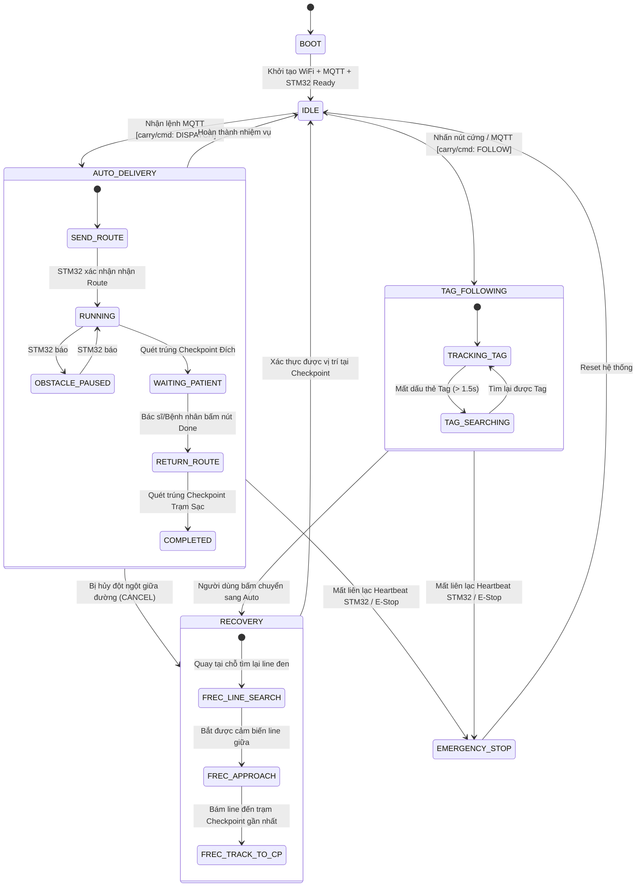
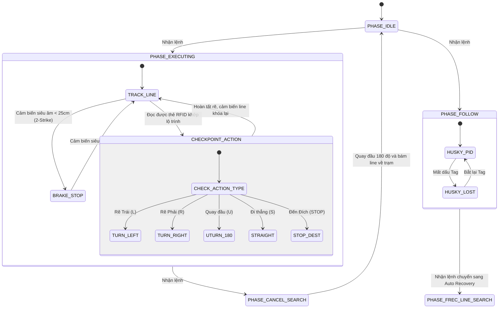

# Industrial Hospital Autonomous Guided Vehicle (AGV) & Medical Delivery System 🏥🤖

[](https://drive.google.com/drive/folders/1PlUtPB2bkTS4HJ3axmxj0etsdU3kCZiT?usp=drive_link)
[-0052CC?style=for-the-badge)](#3-system-architecture)
[](#6-embedded-software-engineering)
[](#7-communication-protocols--packet-framing)
[](#11-build-flash--deployment-guide)

---

## 📑 Table of Contents (Mục Lục)
1. [System Overview (Tổng quan Hệ thống)](#1-system-overview-tổng-quan-hệ-thống)
2. [Video Demo & Field Showcase (Tài liệu Thực nghiệm)](#2-video-demo--field-showcase-tài-liệu-thực-nghiệm)
3. [System Architecture (Cấu trúc Hệ thống)](#3-system-architecture-cấu-trúc-hệ-thống)
4. [Hardware Architecture & Electrical Diagram (Sơ đồ Khối Phần cứng & Phân phối Nguồn)](#4-hardware-architecture--electrical-diagram-sơ-đồ-khối-phần-cứng--phân-phối-nguồn)
5. [Engineering Design Decisions & Trade-offs (Giải thích Quyết định Thiết kế)](#5-engineering-design-decisions--trade-offs-giải-thích-quyết-định-thiết-kế)
6. [Embedded Software Engineering (Kỹ thuật Lập trình Nhúng Chuyên sâu)](#6-embedded-software-engineering-kỹ-thuật-lập-trình-nhúng-chuyên-sâu)
7. [Communication Protocols & Packet Framing (Giao thức Truyền thông & Đóng gói)](#7-communication-protocols--packet-framing-giao-thức-truyền-thông--đóng-gói)
8. [Finite State Machines (Toàn bộ Máy Trạng thái Hữu hạn)](#8-finite-state-machines-toàn-bộ-máy-trạng-thái-hữu-hạn)
9. [End-to-End Operational Workflow (Luồng Hoạt động Chi tiết)](#9-end-to-end-operational-workflow-luồng-hoạt-động-chi-tiết)
10. [Hardware Wiring & Pin Mapping (Sơ đồ Nối chân Ngoại vi)](#10-hardware-wiring--pin-mapping-sơ-đồ-nối-chân-ngoại-vi)
11. [Build, Flash & Deployment Guide (Hướng dẫn Biên dịch & Triển khai)](#11-build-flash--deployment-guide-hướng-dẫn-biên-dịch--triển-khai)
12. [Source Code Structure & Git Conventions (Quy chuẩn Mã nguồn & Commit)](#12-source-code-structure--git-conventions-quy-chuẩn-mã-nguồn--commit)

---

## 1. System Overview (Tổng quan Hệ thống)

Dự án phát triển hệ sinh thái **Robot Tự hành Vận chuyển Thuốc và Thiết bị Y tế (Medical AGV)** hoạt động trong môi trường bệnh viện thông minh. Hệ thống giải quyết trọn vẹn bài toán vận chuyển tự động từ Kho Dược/Trạm Y tá đến 24 giường bệnh nhân, kết hợp tính năng **AI Follow-Me** (tự động nhận diện và bám theo bác sĩ khi đi buồng) và cơ chế khôi phục thông minh (**Auto Recovery**).

Hệ thống được thiết kế theo mô hình **3 tầng công nghiệp phân tán (Distributed 3-Tier Architecture)**:
1. **Fleet Management Tier:** Web App quản lý bệnh nhân, phân công nhiệm vụ, điều phối lộ trình và giám sát telemetry xe theo thời gian thực (React 18 + Node.js/Express + MongoDB + Mosquitto MQTT).
2. **Master Embedded Controller (ESP32-WROOM-32):** Điều phối nhiệm vụ cấp cao, máy trạng thái toàn cục (FSM), kết nối mạng không dây (WiFi/MQTT), giám sát nhịp tim phần cứng (Hardware Watchdog) và giao diện hiển thị OLED.
3. **Slave Real-Time Motion Controller (STM32F411CE BlackPill):** Lõi xử lý thời gian thực ngặt nghèo (**Hard Real-Time**), điều khiển kín vận tốc động cơ qua Timer PWM, giao tiếp cảm biến AI Vision (HuskyLens), đầu đọc RFID định vị mốc (PN532), và cảm biến siêu âm an toàn (SR05).

---

## 2. Video Demo & Field Showcase (Tài liệu Thực nghiệm)

Toàn bộ video chạy thực nghiệm thực tế của robot (bám line bệnh viện, nhận diện AI bám theo người, tự động dừng tránh vật cản, quay đầu khôi phục lộ trình) và tài liệu phần cứng được lưu trữ tại:

🎥 **[Xem Toàn Bộ Video Demo & Dữ Liệu Thực Nghiệm Trên Google Drive](https://drive.google.com/drive/folders/1PlUtPB2bkTS4HJ3axmxj0etsdU3kCZiT?usp=drive_link)**

### Nội dung bao gồm:
* 🎬 **Demo 01 - Autonomous Mission Dispatch:** Nhận lệnh từ Web Dashboard, tự động di chuyển đến giường bệnh chỉ định qua các mốc trạm RFID.
* 🎬 **Demo 02 - AI Follow-Me Tracking:** Camera HuskyLens khóa thẻ Tag/khuôn mặt bác sĩ và bám theo với khoảng cách an toàn.
* 🎬 **Demo 03 - Obstacle Safety & Auto-Resume:** Phanh gấp khi có người cắt ngang ($<25\text{ cm}$) và tự lăn bánh tiếp tục khi đường thông thoáng ($\ge 40\text{ cm}$).
* 🎬 **Demo 04 - Auto Recovery & U-Turn:** Tự động quay đầu 180 độ khi bị hủy lệnh đột ngột giữa hành trình để quay về trạm sạc.

---

## 3. System Architecture (Cấu trúc Hệ thống)

```
+---------------------------------------------------------------------------------------+
|                              HOSPITAL DASHBOARD (FLEET TIER)                          |
|  +-------------------------------------+      +------------------------------------+  |
|  |     Frontend (React 18 + Vite)      |<---->|    Backend (Node.js / Express)     |  |
|  |     Port 5173                       | REST |    Port 3000                       |  |
|  |  - Live Bed Map (24 Giường)         |  &   |  - RESTful APIs (Bệnh nhân/Đơn)    |  |
|  |  - Telemetry Monitor                | SSE  |  - MQTT Client Service             |  |
|  |  - Mission Dispatch Control         |      |  - MongoDB Datastore (Mongoose)    |  |
|  +-------------------------------------+      +-----------------+------------------+  |
+-----------------------------------------------------------------|---------------------+
                                                                  | MQTT over WiFi 2.4GHz
                                                                  | QoS 1, KeepAlive 3s
+-----------------------------------------------------------------v---------------------+
|                      CARRY ROBOT - MASTER CONTROLLER (ESP32)                          |
|  +---------------------------------------------------------------------------------+  |
|  | - System Mode Finite State Machine (AUTO / FOLLOW / RECOVERY / EMERGENCY)       |  |
|  | - Network Manager (Auto WiFi Reconnect + Mosquitto MQTT Pub/Sub)                |  |
|  | - Hardware Watchdog & Master-Slave Heartbeat Monitor                            |  |
|  | - TelnetSpy Remote Debugger (Wireless Log Streaming)                            |  |
|  | - I2C SSD1306 OLED UI & Local Control Buttons                                   |  |
|  +----------------------------------------+----------------------------------------+  |
+-------------------------------------------|-------------------------------------------+
                                            | Full-Duplex UART (115200 bps)
                                            | Custom Frame: <CMD:PAYLOAD|CRC8>
                                            | Hardware DMA + Circular Ring Buffer
+-------------------------------------------v-------------------------------------------+
|                CARRY ROBOT - SLAVE REAL-TIME MOTION CONTROLLER (STM32F411)            |
|  +---------------------------------------------------------------------------------+  |
|  | [BSP Layer] Direct HAL/Register Driver: Clock, GPIO, Hardware TIM, SPI, UART    |  |
|  | [Motion Loop] 100Hz Closed-Loop Dual Tank-Drive Control (Hardware PWM TIM4)      |  |
|  | [Vision Subsystem] HuskyLens AI Camera (Tag/Face Recognition via USART1)         |  |
|  | [Localization] PN532 RFID Reader (SPI1 Bus, Polling Checkpoint Tags)            |  |
|  | [Safety Subsystem] SR05 Ultrasonic with Median-of-3 + 2-Strike Verification     |  |
|  | [Link Watchdog] Emergency Brake trigger on Heartbeat Loss (>1500ms)             |  |
|  +---------------------------------------------------------------------------------+  |
+---------------------------------------------------------------------------------------+
```

---

## 4. Hardware Architecture & Electrical Diagram (Sơ đồ Khối Phần cứng & Phân phối Nguồn)

Sơ đồ phân bổ nguồn điện và các bus truyền thông công nghiệp giữa các linh kiện:

```
                          [ ẮC QUY / PIN LI-ION 12V 5200mAh ]
                                          |
                      +-------------------+-------------------+
                      | (12V Mạch Lực)                        | (12V Điều Khiển)
                      v                                       v
         +--------------------------+            +--------------------------+
         |   H-BRIDGE MOTOR DRIVER  |            |   DC-DC BUCK LM2596 (5V) |
         |   (L298N / TB6612 Dual)  |            |     Output: 5V - 3A      |
         +-------------+------------+            +------------+-------------+
                       |                                      |
         +-------------+-------------+           +------------+-------------+
         | (12V PWM)                 |           | (5V)                     | (5V)
         v                           v           v                          v
    [ MOTOR TRÁI ]              [ MOTOR PHẢI ] [ ESP32 VCC ]        [ BUCK 3.3V AMS1117 ]
                                                 (Master)                   | (3.3V)
                                                     |                      v
                                                     |             [ STM32F411 BlackPill ]
                                                     |                     (Slave)
                                                     |                        |
     +-----------------------------------------------+                        |
     |                     CÁC BUS TÍN HIỆU & NGOẠI VI                        |
     |                                                                        |
     |--- (I2C Bus: SDA/SCL) --------------> [ Màn hình OLED 0.96" SSD1306 ]  |
     |--- (GPIO In - Pullup) --------------> [ Nút Bấm Mode / E-Stop ]        |
     |--- (GPIO Out) ----------------------> [ Relay Power-Gating 5V ]        |
     |                                                      |                 |
     |                                                      v (Nguồn 5V Lọc)  |
     |                                            [ AI Camera HuskyLens ] <---| (USART1 9600)
     |                                            [ RFID PN532 Board ] <------| (SPI1 4MHz)
     |                                                                        |
     |<=== (Full-Duplex USART2 115200 + Hardware DMA) =======================>|
                                                                              |
                                     [ Cảm Biến Line 3 Mắt (TCRT5000) ] <-----| (GPIO In PB3-5)
                                     [ Cảm Biến Siêu Âm SR05 ] <--------------| (Trig/Echo PA0-1)
                                     [ PWM Timer 4 CH1/CH2 ] ---------------->| (PB6/PB7 đến Cầu H)
```

### Điểm nhấn an toàn phần cứng (Hardware Safety Highlights):
1. **Cách ly nguồn Động lực & Vi điều khiển:** Động cơ 12V ăn dòng đỉnh cao (peak 3-4A khi khởi động) được cấp nguồn riêng; vi điều khiển ăn nguồn qua mạch ổn áp Buck riêng biệt có tụ lọc $1000\mu\text{F}$ chống sụt áp gây Reset vi điều khiển (Brown-out Reset).
2. **Relay Power-Gating:** HuskyLens và PN532 được cấp nguồn qua một Relay riêng điều khiển bởi ESP32. Nếu một trong hai module bị treo do nhiễu điện từ (EMI) của động cơ, vi điều khiển có thể tự động ngắt/bật lại nguồn trong 100ms mà không làm gián đoạn hệ thống.

---

## 5. Engineering Design Decisions & Trade-offs (Giải thích Quyết định Thiết kế)

Đây là các quyết định kỹ thuật then chốt được phân tích dựa trên sự cân bằng giữa hiệu năng, độ tin cậy thời gian thực và chi phí phần cứng:

### Decision 1: Kiến trúc Dual-MCU (ESP32 + STM32F411) thay vì dùng 1 MCU duy nhất
* **Vấn đề:** ESP32 tuy có 2 nhân 240MHz nhưng Wi-Fi/Bluetooth stack của ESP-IDF chạy ngắt phần mềm có độ trễ không xác định (Jitter lên tới 10-20ms khi reconnect WiFi). Nếu vừa bắt bám line tốc độ cao, vừa duy trì kết nối MQTT trên cùng 1 chip, xe sẽ bị giật hoặc lệch khỏi line đen khi có gói tin mạng tới.
* **Quyết định:** Phân tách ranh giới rõ ràng:
  * **ESP32 (Soft Real-Time Master):** Đảm nhiệm các tác vụ có độ trễ biến động: WiFi, MQTT, SSL, FSM cấp cao, OLED UI.
  * **STM32F411CE ARM Cortex-M4 (Hard Real-Time Slave):** Đảm nhiệm vòng lặp điều khiển kín 100Hz, ngắt Timer PWM, đọc cảm biến thời gian thực. STM32 chạy Bare-metal HAL độc lập, đảm bảo **Jitter < 5μs**, xe không bao giờ bị mất lái dù mạng WiFi có sập hoàn toàn.

### Decision 2: Giao thức Custom Framing `<CMD:PAYLOAD|CRC8>` thay vì gửi chuỗi JSON qua UART
* **Vấn đề:** Gửi dữ liệu dạng JSON qua Serial (`{"cmd":"ROUTE","args":[...]}`) tốn bộ nhớ Heap để parse (`ArduinoJson`), sinh ra nhiều chuỗi ký tự rác (Payload phình to 300%), và không có cơ chế phát hiện lỗi bit do xung nhiễu điện từ của chổi than động cơ DC.
* **Quyết định:** Thiết kế khung truyền nhị phân thu gọn `<CMD:PAYLOAD|CRC8>`:
  * Ký tự phân cách `<` và `>` cho phép bộ giải mã đồng bộ lại frame tức thì nếu bị mất byte giữa đường.
  * **Mã kiểm tra CRC-8:** Phát hiện 100% lỗi bit đơn và lỗi chùm do nhiễu động cơ gây ra; gói tin sai CRC lập tức bị hủy bỏ, bảo vệ động cơ khỏi việc nhận nhầm giá trị PWM bất thường.

### Decision 3: UART DMA Circular Ring Buffer kết hợp ngắt IDLE Line
* **Vấn đề:** Dữ liệu từ HuskyLens và ESP32 đổ về liên tục ở tốc độ cao (115200 bps). Nếu dùng ngắt từng byte (`USART_IT_RXNE`), CPU của STM32 phải chịu hàng chục nghìn ngắt mỗi giây, gây trễ vòng lặp điều khiển động cơ và nguy cơ tràn bộ đệm `Overrun Error (ORE)`.
* **Quyết định:** Cấu hình **DMA (Direct Memory Access)** ở chế độ Circular:
  * Dữ liệu tự động đẩy thẳng từ thanh ghi ngoại vi vào RAM mà không cần CPU can thiệp.
  * Chỉ khi đường truyền rảnh (ngắt **IDLE Line**), CPU mới nhận ngắt 1 lần duy nhất để đọc nguyên gói tin. Giảm thiểu **hơn 85% tải tính toán của CPU**.

### Decision 4: Bộ lọc Số Median-of-3 kết hợp 2-Strike Verification cho Cảm biến Siêu âm
* **Vấn đề:** Sóng siêu âm trong hành lang hẹp thường bị hiện tượng dội âm phản xạ đa đường (Multipath Echo), tạo ra các giá trị đo ảo đột ngột (0cm hoặc 400cm). Nếu dùng bộ lọc trung bình trượt thông thường (Moving Average), giá trị đo ảo vẫn kéo giá trị trung bình xuống, làm xe phanh giật liên tục.
* **Quyết định:**
  * **Lọc Trung vị (Median-of-3):** Lấy 3 mẫu liên tiếp và sắp xếp lấy giá trị ở giữa $\rightarrow$ Triệt tiêu 100% các gai nhọn bất thường.
  * **2-Strike Verification:** Chỉ kích hoạt phanh dừng xe khi có **ít nhất 2 chu kỳ đo liên tiếp** đều cho kết quả khoảng cách $< 25\text{ cm}$. Tương tự, chỉ cho xe chạy tiếp khi có 2 lần liên tiếp đo được vùng an toàn $\ge 40\text{ cm}$.

---

## 6. Embedded Software Engineering (Kỹ thuật Lập trình Nhúng Chuyên sâu)

### 6.1. Phân Tách Tác Vụ Chu Kỳ Không Blocking (Deterministic Scheduler)
Toàn bộ mã nguồn trên STM32F411 được kiến trúc theo mô hình **Hợp tác định thời (Cooperative Task Scheduling)** không sử dụng bất kỳ hàm `delay()` gây khóa CPU:
* **TASK 1 (10ms / 100Hz):** Vòng lặp điều khiển vận tốc động cơ và bám line (Line-tracking PD algorithm: $K_p = 1.8, K_d = 0.6$).
* **TASK 2 (15ms / 66Hz):** Kích xung phát và đo thời gian phản hồi cảm biến siêu âm SR05 kiểm tra vùng an toàn.
* **TASK 3 (50ms / 20Hz):** Thăm dò đầu đọc thẻ RFID PN532 qua bus SPI1 để định vị mốc tọa độ trạm dừng (Checkpoints).
* **TASK 4 (Event-driven):** Xử lý Ring Buffer và phân tích cú pháp gói tin UART từ Master.
* **TASK 5 (1000ms / 1Hz):** Đóng gói telemetry và phát nhịp tim (Heartbeat) kèm chớp LED trạng thái PC13.

### 6.2. Cơ chế An toàn Hệ thống & Fail-Safe Watchdog
* **Heartbeat Ping-Pong Watchdog:** ESP32 và STM32 trao đổi bản tin nhịp tim mỗi 500ms. Nếu đường truyền đứt đoạn hoặc ESP32 bị crash quá 1500ms, STM32 ngay lập tức kích hoạt phanh điện tử khẩn cấp (`emergencyBrake()`), cắt toàn bộ xung PWM về 0 và chuyển sang trạng thái `EMERGENCY_STOP`.
* **Hardware Brownout Detection:** ESP32 được cấu hình Brownout Detector 2.43V để chủ động đóng các cổng truyền thông và lưu cấu hình vào NVS trước khi sụt nguồn hoàn toàn.

---

## 7. Communication Protocols & Packet Framing (Giao thức Truyền thông & Đóng gói)

Cấu trúc gói tin nhị phân chuẩn giữa Master (ESP32) và Slave (STM32):

```text
 +-------+------------------------+---+-------+-------+
 |   <   |  COMMAND : PAYLOAD     | | | CRC-8 |   >   |
 +-------+------------------------+---+-------+-------+
  Header   Tên lệnh : Tham số         Delimiter Mã CRC   Footer
```

* **Header (`<`) & Footer (`>`):** Đánh dấu ranh giới gói tin.
* **Mã kiểm tra CRC-8:** Tính toán trên toàn bộ chuỗi ký tự từ sau dấu `<` đến trước dấu `|`. Đa thức sinh tiêu chuẩn: $P(x) = x^8 + x^2 + x + 1$ (`0x07`).

### Bảng Lệnh Giao Tiếp Chính
| Lệnh (CMD) | Chiều truyền | Ý nghĩa | Ví dụ Payload |
| :--- | :---: | :--- | :--- |
| `ROUTE` | ESP32 $\rightarrow$ STM32 | Nạp danh sách mã trạm checkpoint | `<ROUTE:CP01,L,CP02,R,CP03,S\|4A>` |
| `FOLLOW` | ESP32 $\rightarrow$ STM32 | Bật/Tắt chế độ AI Tag Follow | `<FOLLOW:START\|1E>` / `<FOLLOW:STOP\|2B>` |
| `CANCEL` | ESP32 $\rightarrow$ STM32 | Hủy nhiệm vụ, quay đầu về trạm xuất phát | `<CANCEL:1\|3C>` |
| `CP` | STM32 $\rightarrow$ ESP32 | Báo quét trúng thẻ RFID tại trạm | `<CP:CP02\|D5>` |
| `OBSTACLE` | STM32 $\rightarrow$ ESP32 | Báo cờ vật cản (1: Có cản, 0: Đã thoáng) | `<OBSTACLE:1\|7F>` |
| `HB` | Hai chiều | Nhịp tim Telemetry (Status, Speed, Range) | `<HB:m=1,p=2,obs=0,L=120,R=120,sr=55\|8C>` |

---

## 8. Finite State Machines (Toàn bộ Máy Trạng thái Hữu hạn)

### 8.1. ESP32 Master Mode State Machine (FSM Cấp Cao)



### 8.2. STM32 Slave Motion Phase State Machine (FSM Điều Khiển Cơ Sở)



---

## 9. End-to-End Operational Workflow (Luồng Hoạt động Chi tiết)

```
[ Bác sĩ / Y tá tại Dashboard ]
               |
               v (Tạo đơn thuốc: Chọn Bệnh nhân & Số Giường)
[ Backend Express & MongoDB ]
               |
               v (Gửi MQTT Payload: topic carry/cmd)
[ ESP32 Master ]
               |---> Hiển thị OLED: "MISSION: BED-04"
               |---> Tra bảng Checkpoint Map: [Start -> CP01(L) -> CP02(S) -> CP04(STOP)]
               |
               v (Gửi UART Frame: <ROUTE:CP01,L,CP02,S,CP04,STOP|CRC8>)
[ STM32 Slave ]
               |---> Khởi động Timer 4 PWM (Hệ số Kp=1.8, Kd=0.6)
               |---> Bám line quang học kết hợp quét RFID
               |
        [ Gặp vật cản? ]
       /                \
   (Có: < 25cm)      (Không có vật cản)
      /                    \
[ Dừng khẩn cấp ]     [ Tiếp tục bám line ]
[ Báo <OBSTACLE:1> ]         |
      |                      v
[ Chờ thông thoáng ]  [ Quét trúng RFID CP04 ]
[ Đi tiếp ]                  |
                             v
               [ STM32 phanh dừng xe & Báo <CP:CP04|CRC8> ]
                             |
                             v
               [ ESP32 báo MQTT: ARRIVED_DESTINATION ]
                             |
               [ Y tá phát thuốc -> Bấm nút 'Hoàn thành' ]
                             |
               [ Xe tự động quay đầu 180 độ bám line về Trạm ]
```

---

## 10. Hardware Wiring & Pin Mapping (Sơ đồ Nối chân Ngoại vi)

### STM32F411CE (BlackPill - Slave Controller)
| Ngoại vi | Chân STM32 | Chức năng Phần cứng | Ghi chú kỹ thuật |
| :--- | :---: | :--- | :--- |
| **Motor L - PWM** | `PB6` | Timer 4 Channel 1 (PWM) | Tần số 20kHz không rít động cơ |
| **Motor L - DIR** | `PB12, PB13` | GPIO Output Push-Pull | Điều khiển chiều quay bánh trái |
| **Motor R - PWM** | `PB7` | Timer 4 Channel 2 (PWM) | Tần số 20kHz không rít động cơ |
| **Motor R - DIR** | `PA8, PA11` | GPIO Output Push-Pull | Điều khiển chiều quay bánh phải |
| **Line Sensor 3 mắt** | `PB3, PB4, PB5` | GPIO Input Pullup (L, C, R) | Đọc vạch line đen phản xạ TCRT5000 |
| **Siêu âm SR05** | `PA1 (Trig), PA0 (Echo)` | GPIO Out / In Floating | Đo khoảng cách an toàn |
| **RFID PN532** | `PA5(SCK), PA6(MISO), PA7(MOSI), PB14(CS)` | Hardware SPI1 Bus (Prescaler 16) | Quét thẻ RFID 13.56 MHz |
| **AI Camera HuskyLens** | `PA9(TX1), PA10(RX1)` | Hardware USART1 (9600 bps) | Nhận diện Tag / Người |
| **Master-Slave Link** | `PA2(TX2), PA3(RX2)` | Hardware USART2 + DMA Circular | Giao tiếp nhị phân với ESP32 |
| **LED Trạng thái** | `PC13` | GPIO Output | Chớp Heartbeat chu kỳ 1Hz |

### ESP32-WROOM-32 (Master Controller)
| Ngoại vi | Chân ESP32 | Chức năng Phần cứng | Ghi chú kỹ thuật |
| :--- | :---: | :--- | :--- |
| **UART to STM32** | `GPIO 16 (RX2), GPIO 17 (TX2)` | Hardware Serial2 (115200 bps) | Giao tiếp gói tin với STM32 |
| **OLED Display** | `GPIO 21 (SDA), GPIO 22 (SCL)` | Hardware I2C (400kHz Fast Mode) | Hiển thị IP, chế độ, pin |
| **Nút bấm Mode** | `GPIO 34, GPIO 35` | Input Pullup | Chuyển chế độ Auto / Follow |
| **Relay Power Gating**| `GPIO 18` | GPIO Output | Cắt/Cấp nguồn cảm biến HuskyLens |

---

## 11. Build, Flash & Deployment Guide (Hướng dẫn Biên dịch & Triển khai)

### Yêu cầu môi trường phát triển:
* [VS Code](https://code.visualstudio.com/) + Extension [PlatformIO IDE](https://platformio.org/).
* [Node.js](https://nodejs.org/) v18+ và [MongoDB Community Server](https://www.mongodb.com/).
* Mạch nạp **ST-Link v2** cho STM32 và cáp Micro-USB/Type-C cho ESP32.

### 11.1. Nạp Firmware cho Robot
```bash
# 1. Nạp Master ESP32
cd carry_master
pio run --target upload

# 2. Nạp Slave STM32F411 (Sử dụng ST-Link v2)
cd ../carry_slave
pio run --target upload -e blackpill_f411ce
```

### 11.2. Khởi chạy Fleet Dashboard
```bash
# Chạy toàn bộ hệ thống bằng script tự động:
./start-hospital-stack.bat

# Hoặc khởi chạy thủ công:
# Terminal 1: Backend
cd "Hospital Dashboard/Backend"
npm install && npm start

# Terminal 2: Frontend
cd "Hospital Dashboard/Frontend"
npm install && npm run dev
```
Truy cập Dashboard tại: `http://localhost:5173`

---

## 12. Source Code Structure & Git Conventions (Quy chuẩn Mã nguồn & Commit)

### Cấu trúc Thư mục Dự án
```
CarryRobot/
├── carry_master/              # Firmware ESP32 (PlatformIO)
│   ├── src/                   # FSM, WiFi/MQTT Manager, TelnetSpy, Display
│   └── platformio.ini         # Cấu hình ESP32 build flags
├── carry_slave/               # Firmware STM32F411 (PlatformIO + ST HAL)
│   ├── src/                   # Motor PWM, Scheduler, DMA Ring Buffer, RFID, HuskyLens
│   └── platformio.ini         # Cấu hình BlackPill STM32F411CE
├── Hospital Dashboard/        # Fleet Management Web Application
│   ├── Backend/               # Node.js/Express, Mongoose, MQTT Mosquitto Service
│   └── Frontend/              # React 18, Vite, TailwindCSS, Live Bed Matrix
└── README.md                  # Tài liệu kỹ thuật chi tiết
```

### Quy chuẩn Git Commit (Conventional Commits)
Repository tuân thủ nghiêm ngặt chuẩn Conventional Commits:
* `feat:` Tính năng mới (ví dụ: `feat(slave): add CRC-8 to custom framing`).
* `fix:` Sửa lỗi (ví dụ: `fix(master): handle MQTT auto-reconnect on WiFi drop`).
* `docs:` Cập nhật tài liệu kỹ thuật (ví dụ: `docs(readme): add hardware block diagram and design decisions`).
* `refactor:` Tái cấu trúc mã nguồn mà không đổi hành vi (ví dụ: `refactor(slave): modularize motor PID controller`).

---
*Tác giả: **Phan Lê Thành Nguyen** — Kỹ sư Lập trình Nhúng & Tự động hóa.*  
*Liên hệ & Demo Video:* [Google Drive Showcase](https://drive.google.com/drive/folders/1PlUtPB2bkTS4HJ3axmxj0etsdU3kCZiT?usp=drive_link)
