# Hospital Robot System

## Table of Contents
1. [System Overview](#1-system-overview)
2. [Architecture](#2-architecture)
3. [MoSCoW Requirements](#3-moscow-requirements)
4. [Functional Requirements](#4-functional-requirements)
5. [Non-Functional Requirements](#5-non-functional-requirements)
6. [Carry Robot – ESP32 Master](#6-carry-robot--esp32-master)
7. [Carry Robot – STM32 Slave](#7-carry-robot--stm32-slave)
8. [Hospital Dashboard – Backend](#8-hospital-dashboard--backend)
9. [Hospital Dashboard – Frontend](#9-hospital-dashboard--frontend)
10. [Communication Protocols](#10-communication-protocols)
11. [Development & Build](#11-development--build)
12. [Mode State Machines (AUTO / FOLLOW / RECOVERY)](#12-mode-state-machines-auto--follow--recovery)

---

## 1. System Overview

An autonomous hospital medication delivery system consisting of two tightly integrated components:

| Component | Location | Role |
|-----------|----------|------|
| **Carry Robot** | `CarryRobot/carry_final/` | Dual-MCU mobile robot (ESP32 Master + STM32 Slave) that physically transports medication from the medicine station to patient beds and returns autonomously |
| **Hospital Dashboard** | `Hospital Dashboard/` | Full-stack web application (Express.js + React + MongoDB) for patient management, robot monitoring, mission dispatch, and live tracking |

---

## 2. Architecture

```
+---------------------------------------------------------------------+
|                       Hospital Dashboard                             |
|  +---------------------+    +----------------------------------+   |
|  |  Frontend (React)   |<-->|  Backend (Node.js / Express)     |   |
|  |  Port 5173          |    |  Port 3000                       |   |
|  |  - PatientDashboard |    |  - REST API                      |   |
|  |  - RobotCenter      |    |  - MQTT Service (Mosquitto 1883) |   |
|  |  - RobotLiveTracking|    |  - MongoDB / Mongoose            |   |
|  |  - RobotTestLab     |    |  - SSE live-stream               |   |
|  |  - MissionHistory   |    |  - Models: Robot, Mission,       |   |
|  |  - BedMap (24 beds) |    |    Patient, Alert, Map, User     |   |
|  +---------------------+    +----------------+-----------------+   |
+------------------------------------------------|--------------------+
                                                 | MQTT over WiFi 2.4 GHz
                             +-------------------v---------------------+
                             |        ESP32 Master (CARRY-01)          |
                             |  - State Machine (AUTO/FOLLOW/RECOVERY) |
                             |  - WiFiManager + MQTT                   |
                             |  - HuskyLens (tag + line tracking)      |
                             |  - Servo Gimbal X/Y                     |
                             |  - SR05 Ultrasonic x2 (wall avoidance)  |
                             |  - OLED SH1106 display                  |
                             |  - Buzzer + Push button                 |
                             |  - Relay R1 (vision) / R2 (line+NFC)   |
                             +-------------------+---------------------+
                                                 | UART (115200 baud)
                                                 | TX=GPIO17 / RX=GPIO16
                             +-------------------v---------------------+
                             |        STM32F103 Slave (Blue Pill)      |
                             |  - Mecanum drive (2x L298N, 4 motors)   |
                             |  - PN532 NFC/RFID reader (SPI)          |
                             |  - 3-sensor line follower (PID)         |
                             |  - VL53L0X ToF (obstacle detection)     |
                             |  - Route runner (autonomous navigation) |
                             +-----------------------------------------+
```

### Data Flow – Medication Delivery
```
Staff selects patient on Dashboard
    |
    v
POST /api/missions/delivery  -->  Backend computes route (Dijkstra)
    |                             publishes MQTT mission/assign
    v
ESP32 Master receives route via MQTT
    |  stores route, waits for single-click confirmation
    v
[Button click] --> sends CMD_SET_MODE + CMD_SEND_ROUTE to STM32 via UART
    |
    v
STM32 Slave executes route (line follow + NFC checkpoint matching)
    |  reports CMD_CHECKPOINT, CMD_BATTERY back over UART
    v
ESP32 publishes mission/progress, mission/complete --> Dashboard updated
    |
    v
Robot waits at bed for pickup confirmation --> returns to MED station
    |
    v
ESP32 publishes mission/returned --> Dashboard marks delivered
```

---

## 3. MoSCoW Requirements

### Must Have (M)
> Core features without which the system cannot function

| ID | Requirement |
|----|-------------|
| M-01 | Robot must autonomously navigate from the medicine station (MED) to a specified patient bed using NFC checkpoints and line following |
| M-02 | Robot must return to MED station automatically after medication is collected |
| M-03 | Dashboard must allow staff to assign a delivery mission to the robot by selecting a patient and bed |
| M-04 | Patient records must be stored and retrievable (name, MRN, bed assignment, status, prescriptions) |
| M-05 | Real-time robot status (idle/busy/offline) must be visible on the Dashboard |
| M-06 | ESP32 Master and STM32 Slave must communicate reliably via UART (framed protocol with STX + CRC) |
| M-07 | MQTT communication between the Dashboard Backend and the robot must be maintained over WiFi |
| M-08 | Obstacle detection must pause robot movement when an object is <= 200 mm in front (VL53L0X ToF) |
| M-09 | Missions must be cancellable from the Dashboard at any time |
| M-10 | System must support at least one carry robot with the full delivery/return lifecycle |

### Should Have (S)
> Important features that significantly increase system value

| ID | Requirement |
|----|-------------|
| S-01 | Follow Mode: robot tracks a HuskyLens ArUco/AprilTag to escort a person |
| S-02 | Recovery Mode: if line is lost, servo sweep detects line via HuskyLens, robot re-aligns and requests a return route from the backend |
| S-03 | Live robot position must update on a floor-plan SVG map in real time via SSE |
| S-04 | Mission history must be stored and viewable (paginated delivery log) |
| S-05 | Alert system must notify staff of robot anomalies (obstacle blocked, lost line, battery low) |
| S-06 | OLED display must show current state, patient name, destination, and obstacle warnings |
| S-07 | WiFiManager portal allows reconfiguring WiFi SSID and MQTT server IP without reflashing |
| S-08 | Robot Test Lab panel must allow manual command injection from the Dashboard for debugging |

### Could Have (C)
> Desirable features that can be deferred

| ID | Requirement |
|----|-------------|
| C-01 | Patient photo upload and display in PatientForm |
| C-02 | Dual relay control to power-cycle peripheral modules (vision relay R1, line+NFC relay R2) |
| C-03 | RFID/NFC card used to look up patient records directly from the Dashboard (Web Serial API) |
| C-04 | Bed map visualisation showing occupied / available / robot-active beds on the Dashboard |
| C-05 | Prescriptions, clinical notes, and timeline entries can be added and edited per patient |
| C-06 | Map graph stored in MongoDB; Dijkstra-based shortest-path API alongside hard-coded routes |
| C-07 | Idle NFC scans are published to the Dashboard even when not on a mission |

### Won't Have (W)
> Explicitly out of scope for the current version

| ID | Requirement |
|----|-------------|
| W-01 | Multi-robot simultaneous delivery (only one carry robot supported at a time) |
| W-02 | Authentication or role-based access control on any API route or Dashboard page |
| W-03 | Real battery voltage measurement on ESP32 (battery level is currently hardcoded to 100%) |
| W-04 | 3D or dynamic map generation; map is static and pre-seeded |
| W-05 | Voice or audio commands to the robot |
| W-06 | Over-the-air (OTA) firmware updates to either ESP32 or STM32 |

---

## 4. Functional Requirements

### FR-01 – Autonomous Medication Delivery
- System shall compute a route from MED to the target bed node when a delivery mission is created via `POST /api/missions/delivery`.
- Route shall include ordered NFC checkpoint IDs and per-node actions (straight, turn-left, turn-right, stop).
- STM32 Slave shall follow the line and match NFC UIDs to advance along the route.
- Robot shall stop and wait at the destination bed for a configurable timeout or button press before returning.

### FR-02 – Autonomous Return
- After delivery, STM32 shall navigate the return route (reversed outbound path) back to MED.
- On cancellation mid-mission, ESP32 shall publish `position/waiting_return`; Backend shall compute and send a return route via MQTT `mission/return_route`.

### FR-03 – Follow Mode
- Single-click from IDLE activates Follow Mode if a tag is in HuskyLens view.
- ESP32 shall read HuskyLens tag position (X-centre, area) and compute Vx / Vy / Vr velocity commands.
- Velocity commands are sent to STM32 over UART every ~50 ms.
- Side wall distances (SR05 L/R) shall contribute a lateral correction component (Vx).
- If tag is lost for > 10 s, mode transitions to Find Mode.

### FR-04 – Recovery Mode
- When line is lost on the STM32 (lineBits = 0) or double-click in Follow, ESP32 enters Recovery.
- Servo X sweeps 0 to 180 degrees until HuskyLens detects a line; STM32 aligns to it.
- Robot reads the next NFC checkpoint, sends it to Backend to compute a return route, and navigates home.
- If no line is found after 3 sweeps, the buzzer alerts staff.

### FR-05 – Obstacle Avoidance
- STM32 VL53L0X continuously polls; if distance <= 200 mm the robot stops immediately.
- Movement resumes only when distance > 300 mm (hysteresis).

### FR-06 – Patient Management
- Create, read, update, and delete patient records including: full name, MRN, DOB, gender, status, doctor, room/bed, relative contact, insurance, photo.
- Associate or remove prescriptions, timeline entries, and clinical notes per patient.
- Lookup patient by RFID card number via `GET /api/patients/by-card/:cardNumber`.

### FR-07 – Mission Management
- Dashboard shall display all transport missions with status filter (pending / en_route / arrived / completed / failed / cancelled).
- Staff may cancel any active mission; Backend publishes MQTT `mission/cancel` to the robot.
- Delivery history is paginated and displayable.

### FR-08 – Robot Telemetry
- ESP32 publishes telemetry every 5 s: robotId, status, batteryLevel, currentNodeId, destBed, firmware version.
- Backend upserts the Robot document; marks online if `lastSeenAt` within 30 s.
- Low battery (<= 30%) creates an Alert and sets robot status to `low_battery`.

### FR-09 – Alert System
- Alerts are created for: obstacle blocked, line lost (rescue required), low battery.
- Unresolved alerts are displayed on the Dashboard with severity level.
- Staff can resolve alerts individually via `PUT /api/alerts/:id/resolve`.

### FR-10 – Live Position Tracking
- Backend emits Server-Sent Events (SSE) on `GET /api/robots/live` on every telemetry/progress update.
- Frontend RobotLiveTracking subscribes to SSE and animates the robot icon on the SVG floor plan.
- SVG contains all 37 nodes (MED, corridor, junctions, 4 rooms x 8 nodes each).

### FR-11 – Debug / Test Lab
- RobotTestLab panel allows direct command injection: set mode, adjust spin/brake timing, toggle relays, read sensor values.
- Commands are sent to the robot via `POST /api/robots/:id/command` -> MQTT `command` topic.

### FR-12 – Map Management
- Floor map with nodes and weighted edges is stored in MongoDB (MapGraph model).
- `GET /api/maps/:mapId/route?from=&to=` returns Dijkstra shortest path.
- Initial `floor1` map with 37 nodes is seeded via `node seed/seedMap.js`.

---

## 5. Non-Functional Requirements

### NFR-01 – Performance

| Metric | Target |
|--------|--------|
| UART round-trip latency (ESP32 <-> STM32) | < 10 ms at 115200 baud |
| MQTT telemetry publish interval | 5 s |
| MQTT message delivery (QoS 1) | < 500 ms on local LAN |
| Backend REST API response (CRUD) | < 300 ms (MongoDB local) |
| SSE live-position update lag | < 1 s |
| Frontend initial page load | < 3 s on LAN |

### NFR-02 – Reliability
- UART framing uses STX header (0x7E) + CRC16; corrupt frames are silently discarded.
- MQTT client auto-reconnects every 3 s on disconnection; mission state is preserved in NVS.
- WiFiManager portal is triggered on connection failure, ensuring the robot is never permanently offline.
- STM32 UART RX uses interrupt-based reception with a ring buffer for zero-loss frame capture.
- Robot online detection uses a 30 s sliding window to tolerate transient WiFi dropout.

### NFR-03 – Usability
- Dashboard is a single-page application with two top-level tabs (Patients Manager, Robot Center) requiring no navigation knowledge.
- All robot status changes (idle -> busy -> completed) are reflected on the Dashboard without manual page refresh.
- OLED display on the robot shows the current operating mode, patient name, and destination at all times.
- Buzzer provides audible feedback for key events (obstacle, mode change, recovery failure).

### NFR-04 – Maintainability
- Firmware is modular: each mode (auto, follow, find, recovery) is a separate .cpp/.h pair.
- All pin assignments and tunable constants are centralised in `config.h` for each MCU.
- Backend uses ES Modules throughout; routes, models, services, and utils are in separate files.
- Frontend uses TypeScript with typed API layer (`src/app/api/`) separated from UI components.

### NFR-05 – Portability
- Robot is configurable without reflashing: WiFi SSID and MQTT server IP stored in NVS (ESP32) and set via WiFiManager captive portal.
- MQTT broker address defaults to `192.168.137.1` (Windows hotspot) but is overridable via NVS or environment variable.
- Backend database URI and MQTT broker are fully configurable via `.env`.

### NFR-06 – Safety
- Obstacle detection (ToF <= 200 mm) is implemented in firmware and cannot be overridden by software commands from the Dashboard.
- Motors are stopped immediately on `CMD_CANCEL_MISSION` regardless of current state.
- Relay R2 (line sensors + NFC) is power-cycled on mode change to force re-initialisation of the NFC reader, preventing stale reads.

### NFR-07 – Scalability
- MQTT topic structure uses a wildcard prefix `hospital/robots/+/` enabling multiple robots with different IDs to share the same broker.
- Backend Robot model with indexed `type`, `status`, and `lastSeenAt` fields supports future addition of other robot types without schema migration.

### NFR-08 – Security (baseline)
- MQTT broker requires username/password authentication (`hospital_robot` / `hospital_backend`).
- Patient photo upload validates MIME type and limits size to 5 MB.
- No authentication or authorisation on REST routes or Dashboard (explicitly out of scope per W-02).

---

## 6. Carry Robot – ESP32 Master

**Location**: `CarryRobot/carry_final/esp32_master/`  
**Platform**: ESP32 DevKit, Arduino framework (PlatformIO)

### Operating Modes

| Mode | Trigger | Behaviour |
|------|---------|-----------|
| `MODE_IDLE` | Boot / mission complete | Waits for MQTT route or button press |
| `MODE_AUTO` | Single-click (route ready) | Sends route to STM32; supervises NFC progress |
| `MODE_FOLLOW` | Double-click | Tracks HuskyLens tag; controls STM32 velocity |
| `MODE_FIND` | Tag lost > 10 s in FOLLOW | Servo sweep to re-acquire tag |
| `MODE_RECOVERY` | Double-click in FOLLOW | Servo sweep for line; navigates back to MED |

### Pin Mapping

| GPIO | Function |
|------|----------|
| 17 / 16 | UART2 TX/RX -> STM32 (115200 baud) |
| 4 / 5 | UART1 TX/RX -> HuskyLens (9600 baud) |
| 13 / 14 | Servo X / Servo Y (PWM) |
| 34 | Servo X ADC feedback |
| 26 / 27 | SR05 Left TRIG / ECHO |
| 32 / 33 | SR05 Right TRIG / ECHO |
| 21 / 22 | I2C SDA/SCL (OLED SH1106) |
| 25 | Buzzer |
| 15 | Push button (pull-up) |
| 18 / 23 | Relay R1 (vision) / Relay R2 (line+NFC) |

### MQTT Topics (prefix `hospital/robots/CARRY-01/`)

| Topic | Direction | Purpose |
|-------|-----------|---------|
| `telemetry` | Publish (5 s) | Status, battery, current node, dest bed |
| `mission/assign` | Subscribe | Receive route payload from Backend |
| `mission/progress` | Publish | Per-checkpoint update |
| `mission/complete` | Publish | Arrived at destination |
| `mission/returned` | Publish | Back at MED station |
| `mission/cancel` | Subscribe | Abort active mission |
| `mission/return_route` | Subscribe | Backend-computed return route after cancel |
| `position/waiting_return` | Publish | Current position when awaiting return route |
| `command` | Subscribe | Test lab / manual command injection |

### Key Libraries

| Library | Purpose |
|---------|---------|
| WiFiManager ^2.0 | WiFi + MQTT IP configuration portal |
| PubSubClient ^2.8 | MQTT client |
| ArduinoJson ^6 | JSON serialisation for MQTT payloads |
| U8g2 ^2.35 | OLED SH1106 128x64 |
| ESP32Servo ^3.0 | Servo gimbal X/Y |
| HUSKYLENSArduino (git) | HuskyLens tag + line detection API |

### Source File Map

| File | Responsibility |
|------|---------------|
| `main.cpp` | Setup, WiFiManager, boot sequence, button ISR |
| `config.h` | All pin definitions and tunable constants |
| `globals.h/cpp` | Shared state variables across modes |
| `auto_mode.cpp` | AUTO state machine; sends route/cancel to STM32 |
| `follow_mode.cpp` | PID follow controller using HuskyLens tag |
| `find_mode.cpp` | Servo sweep to re-acquire lost tag |
| `recovery_mode.cpp` | Line re-acquisition and return-route navigation |
| `mqtt_client.cpp` | Connect, subscribe, publish, MQTT callbacks |
| `uart_protocol.cpp` | Frame builder/parser (STX + CRC16) |
| `huskylens_uart.cpp` | HuskyLens UART wrapper (tag + line modes) |
| `servo_control.cpp` | X/Y servo with ADC feedback |
| `sr05.cpp` | SR05 ultrasonic distance read (L/R) |
| `oled_display.cpp` | All OLED screen states |
| `relay_control.cpp` | Relay R1 / R2 power sequences per mode |
| `buzzer.cpp` | Tone patterns |
| `button_handler.cpp` | Debounce, single/double/long-press detection |
| `battery.cpp` | Battery ADC read (placeholder: 100%) |

---

## 7. Carry Robot – STM32 Slave

**Location**: `CarryRobot/carry_final/stm32_slave/`  
**Platform**: STM32F103C8 (Blue Pill), Arduino framework (PlatformIO)

### Pin Mapping

| Pin | Function |
|-----|---------|
| PA2 / PA3 | USART2 TX/RX -> ESP32 (115200 baud) |
| PA8, PA9, PA10 | L298N #1 motor control |
| PB12, PB13, PB14, PB15 | L298N #2 motor control |
| PB0 / PC13 / PC14 | PWM channels for motor enable |
| PA5 / PA6 / PA7 / PB1 | SPI1 SCK/MISO/MOSI/SS -> PN532 NFC |
| PB8 / PB9 / PA4 | Line sensors S1 (left) / S2 (center) / S3 (right) |
| PB7 / PB6 | I2C SDA/SCL -> VL53L0X ToF |

### Motor Parameters

| Parameter | Value |
|-----------|-------|
| PWM frequency | 20 kHz |
| PWM resolution | 8-bit |
| Run speed | 200 / 255 |
| Turn speed | 180 / 255 |
| 90-degree turn time | 950 ms |
| 180-degree turn time | 1900 ms |
| Brake PWM | 150 for 80 ms |

### Line Follower PID

| Parameter | Value |
|-----------|-------|
| KP | 0.35 |
| KI | 0.00 |
| KD | 0.20 |
| Max correction | +/- 180 |

### UART Command Set

| CMD | Hex | Direction | Payload |
|-----|-----|-----------|---------|
| `CMD_SET_MODE` | 0x01 | ESP32 -> STM32 | 1 byte: mode enum |
| `CMD_SEND_ROUTE` | 0x02 | ESP32 -> STM32 | [count][id_hi id_lo action] x N |
| `CMD_DIRECT_VEL` | 0x03 | ESP32 -> STM32 | 6 bytes: Vx Vy Vr (int16 each) |
| `CMD_REQUEST_STATUS` | 0x04 | ESP32 -> STM32 | empty |
| `CMD_CANCEL_MISSION` | 0x05 | ESP32 -> STM32 | empty |
| `CMD_ACK` | 0x06 | STM32 -> ESP32 | 1 byte: echoed cmd |
| `CMD_CHECKPOINT` | 0x07 | STM32 -> ESP32 | 2 bytes: checkpoint ID |
| `CMD_BATTERY` | 0x08 | STM32 -> ESP32 | 1 byte: percent |

### Source File Map

| File | Responsibility |
|------|---------------|
| `main.cpp` | Setup, UART frame dispatcher, main loop |
| `config.h` | All pin and constant definitions |
| `globals.h/cpp` | Shared state (mode, route, sensor data) |
| `uart_protocol.cpp` | Frame encode/decode (STX + CRC16) |
| `mecanum.cpp` | Mecanum drive vector computation |
| `motor_control.cpp` | L298N PWM, direction, turn, brake primitives |
| `line_sensor.cpp` | 3-sensor read, PID error calculation |
| `pn532_reader.cpp` | PN532 SPI, UID read with repeat guard (700 ms) |
| `tof_sensor.cpp` | VL53L0X distance read and obstacle logic |
| `auto_runner.cpp` | Route execution state machine (checkpoint matching) |

---

## 8. Hospital Dashboard – Backend

**Location**: `Hospital Dashboard/Backend/`  
**Stack**: Node.js (ES Modules), Express 4, Mongoose 8, MQTT 5, Multer 2  
**Port**: 3000

### MongoDB Models

| Model | Key Fields |
|-------|-----------|
| `Robot` | robotId, name, type, status, batteryLevel, lastSeenAt, currentLocation, transportData, totalDeliveries |
| `TransportMission` | missionId, carryRobotId, patientName, bedId, destinationNodeId, outboundRoute, returnRoute, status, returnedAt |
| `Patient` | fullName, mrn, dob, gender, admissionDate, status, roomBed, primaryDoctor, relativeName, photoPath, timeline[], prescriptions[], notes[] |
| `Alert` | type, level, robotId, missionId, message, resolvedAt |
| `MapGraph` | mapId, nodes[], edges[] (Dijkstra-ready with weights) |
| `User` | uid, name, email (RFID user registry) |
| `Event` | type, uid, robotId, timestamp (button/NFC events) |

### REST API Summary

| Method | Route | Purpose |
|--------|-------|---------|
| GET/POST | `/api/patients` | List (search/filter) + create with photo upload |
| PUT/DELETE | `/api/patients/:id` | Update / delete patient record |
| GET | `/api/patients/:id/details` | Full patient with sub-documents |
| GET | `/api/patients/by-card/:cardNumber` | RFID card lookup |
| POST/DELETE | `/api/patients/:id/prescriptions/:pid` | Manage prescriptions |
| POST/DELETE | `/api/patients/:id/timeline/:tid` | Manage timeline entries |
| POST/DELETE | `/api/patients/:id/notes/:nid` | Manage clinical notes |
| PUT | `/api/robots/:id/telemetry` | Robot heartbeat upsert |
| GET | `/api/robots/carry/status` | Online carry robots with active mission |
| GET | `/api/robots/live` | SSE live position stream |
| POST | `/api/missions/delivery` | Create delivery mission + publish MQTT route |
| GET | `/api/missions/transport` | List missions (filter by status/robotId) |
| POST | `/api/missions/carry/:id/cancel` | Cancel mission + publish MQTT cancel |
| POST | `/api/missions/carry/:id/returned` | Mark returned; increment totalDeliveries |
| GET | `/api/maps/:mapId/route` | Dijkstra shortest path query |
| GET/POST | `/api/alerts` | List active / create new alert |
| PUT | `/api/alerts/:id/resolve` | Resolve alert by ID |

### MQTT Service

Connects to Mosquitto broker (`mqtt://localhost:1883`) as `hospital_backend`.

**Subscribes to** (wildcard `hospital/robots/+/`):
- `telemetry` – upsert Robot document; create alert on low battery
- `mission/progress` – update TransportMission progress fields
- `mission/complete` – set mission status to `completed` or `failed`
- `mission/returned` – set `returnedAt`; increment robot `totalDeliveries`
- `position/waiting_return` – compute return route via Dijkstra; publish back to robot

**Publishes**:
- `mission/assign` (QoS 1) – full route payload to robot on new delivery
- `mission/cancel` (QoS 1) – cancel active mission
- `mission/return_route` (QoS 1) – computed return route after cancellation
- `command` (QoS 1) – test lab manual commands (mode change, relay, etc.)

---

## 9. Hospital Dashboard – Frontend

**Location**: `Hospital Dashboard/Frontend/`  
**Stack**: React 18 + Vite 6 + TypeScript + Tailwind CSS v4 + shadcn/ui  
**Port**: 5173 (Vite proxies `/api` and `/uploads` to backend port 3000)

### Component Map

| Component | Purpose |
|-----------|---------|
| `PatientDashboard` | Patient list with search, filter, sort, and CSV export |
| `PatientForm` | Create / edit patient with RFID scan and camera photo capture |
| `PatientDetails` | Patient detail dialog: prescriptions, timeline, clinical notes |
| `BedMap` | 4-room x 6-bed visual map with occupied / robot-active states |
| `RobotCenter` | Tab container for robot management panels |
| `RobotManagement` | Carry robot status table; send / cancel delivery mission |
| `RobotLiveTracking` | SVG floor plan (900x630) with real-time robot position via SSE |
| `RobotTestLab` | Manual command panel: mode, velocity, relay toggle, sensor readback |
| `MissionHistoryTab` | Paginated delivery history table |
| `RobotHistory` | Per-robot historical statistics |
| `ConnectionStatus` | Header badge polling backend health every 30 s |

### Custom Hooks

| Hook | Polling | Purpose |
|------|---------|---------|
| `usePatients()` | – | Patient CRUD with optimistic updates |
| `useRobots(5000)` | 5 s | Robot status + active mission data |
| `useAlerts(10000)` | 10 s | Active alert list |
| `useMissions()` | – | Mission create, cancel, history |
| `useSerialRFID()` | – | Web Serial API RFID card reader (USB) |

---

## 10. Communication Protocols

### UART Frame Format (ESP32 <-> STM32)
```
[ STX=0x7E | LEN | CMD | DATA (0-N bytes) | CRC16_HI | CRC16_LO ]
```
- CRC16-CCITT (polynomial 0x1021, init 0xFFFF) over LEN + CMD + DATA
- Max frame size: 128 bytes
- Baud rate: 115200, 8N1

### MQTT Payload – `mission/assign` (example)
```json
{
  "missionId": "TM-XXXXXXXXXXXX",
  "patientName": "Nguyen Van A",
  "bedId": "R2M1",
  "route": [
    { "checkpointId": 1, "action": "S" },
    { "checkpointId": 5, "action": "L" }
  ]
}
```

### MQTT Payload – `telemetry` (example)
```json
{
  "robotId": "CARRY-01",
  "status": "busy",
  "batteryLevel": 100,
  "currentNodeId": "H-BOT",
  "destBed": "R2M1",
  "fw": "carry-final-v1",
  "ts": 1712400000000
}
```

---

## 11. Development & Build

### Prerequisites
- Node.js 18+, npm
- PlatformIO Core (pio)
- Mosquitto MQTT broker
- MongoDB (local or Atlas)
- ST-Link V2 (for STM32 flashing)

### Start Development
```bash
# Backend
cd "Hospital Dashboard/Backend"
npm install
npm run dev          # Express on port 3000

# Frontend (separate terminal)
cd "Hospital Dashboard/Frontend"
npm install
npm run dev          # Vite on port 5173
```

### Build and Flash Firmware (PlatformIO)
```bash
# Build
pio run -d CarryRobot/carry_final/esp32_master
pio run -d CarryRobot/carry_final/stm32_slave

# Flash ESP32 (UART, adjust COM port)
pio run -d CarryRobot/carry_final/esp32_master -t upload --upload-port COM15

# Flash STM32 (ST-Link)
pio run -d CarryRobot/carry_final/stm32_slave -t upload

# Serial monitor
pio device monitor -p COM15 -b 115200   # ESP32 Master
```

### Seed Database
```bash
cd "Hospital Dashboard/Backend"
node seed/seedMap.js     # Creates floor1 map with 37 nodes + edges
```

### MQTT Broker (Mosquitto) Config
```
listener 1883
allow_anonymous false
password_file /etc/mosquitto/passwd
# Create users: hospital_robot and hospital_backend with password 123456
```

### Environment Variables (Backend `.env`)
```
MONGO_URI=mongodb://localhost:27017/hospital
MQTT_BROKER=mqtt://localhost:1883
MQTT_USER=hospital_backend
MQTT_PASS=123456
PORT=3000
```

### NFC Node Naming Convention

| Pattern | Description | Examples |
|---------|-------------|---------|
| `MED` | Medicine station (home base) | `MED` |
| `H_MED`, `H_BOT`, `H_TOP` | Hallway corridor checkpoints | `H_BOT` |
| `J1`-`J4` | Junctions (hallway intersections) | `J4` |
| `R{1-4}M{1-3}` | Room beds, M-side (3 per room) | `R1M2` |
| `R{1-4}O{1-3}` | Room beds, O-side (3 per room) | `R2O1` |
| `R{1-4}D{1-2}` | Room doors (2 per room) | `R3D1` |

Total: 37 nodes across 4 rooms (8 nodes each: D1, D2, M1-M3, O1-O3), 3 corridor nodes, 4 junctions, 1 MED.

---

## 12. Mode State Machines (AUTO / FOLLOW / RECOVERY)

The Carry Robot firmware is split between an **ESP32 master** (mission orchestration, MQTT, OLED, button, relays, buzzer) and an **STM32F103 slave** (motors, line sensor, RFID, HuskyLens, servo, ultrasonic). Every operating mode is implemented as a coordinated pair of state machines: the master drives the high-level flow, while the slave runs the real‑time motion/sensor sub-states. Master ↔ slave communication is the framed UART protocol described in Section 10.

This section documents the three top-level modes:

- **AUTO** – mission-driven point-to-point delivery with line following and RFID checkpoints.
- **FOLLOW** – HuskyLens tag-tracking person-follow.
- **FOLLOW → AUTO RECOVERY** – automatic re-entry from FOLLOW back onto a line and home to `MED`.

> Source of truth: [`CarryRobot/carry_master/src/main.cpp`](CarryRobot/carry_master/src/main.cpp), [`CarryRobot/carry_slave/src/main.cpp`](CarryRobot/carry_slave/src/main.cpp), [`CarryRobot/carry_slave/src/huskylens_follow_pid.h`](CarryRobot/carry_slave/src/huskylens_follow_pid.h).

### 12.1 Master state enum (`Sys`) – overview

| Group | States |
|---|---|
| Boot / network | `BOOTING`, `CONNECTING`, `WIFI_AP_PORTAL` |
| AUTO mission | `AUTO_IDLE`, `WAIT_START_OUTBOUND`, `EXECUTING_OUTBOUND`, `AT_LAST_OUTBOUND`, `WAIT_START_RETURN`, `EXECUTING_RETURN`, `DONE_AT_MED` |
| AUTO cancel/recovery | `CANCEL_SEARCH_CP`, `WAIT_RECOVERY_ROUTE`, `EXECUTING_RECOVERY` |
| FOLLOW | `FOLLOW_ACTIVE` |
| FOLLOW→AUTO recovery | `FOLLOW_REC_START`, `FOLLOW_REC_LINE_SEARCH`, `FOLLOW_REC_APPROACH`, `FOLLOW_REC_TRACK_TO_CP`, `FOLLOW_REC_WEB_WAIT`, `FOLLOW_REC_RUN_ROUTE`, `FOLLOW_REC_DONE` |

### 12.2 Slave state enums (`Mode` × `Phase`)

```cpp
enum class Mode  { AUTO, FOLLOW, FOLLOW_RECOVERY };
enum class Phase { IDLE, ROUTE_LOADED, EXECUTING, CANCEL_SEARCH_CP,
                   FREC_LINE_SEARCH, FREC_APPROACH, FREC_TRACK_TO_CP };
```

`Mode` is set by the master via `<MODE:...>` UART frames. `Phase` is set internally on the slave in response to `<ROUTE>`, `<START>`, `<CANCEL_MISSION>`, `<SEARCH_LINE_45>`, `<APPROACH_LINE>`, `<TRACK_TO_CP>` and on RFID/line events.

### 12.3 Top-level mode switch

```mermaid
stateDiagram-v2
    [*] --> BOOTING
    BOOTING --> CONNECTING : setup() done
    CONNECTING --> WIFI_AP_PORTAL : WiFi timeout
    CONNECTING --> AUTO_IDLE : MQTT connected
    AUTO_IDLE --> AUTO : short-press / MQTT mission
    AUTO_IDLE --> FOLLOW_ACTIVE : long-press (>=1500ms)\nrelaysFollow(); MODE:FOLLOW (deferred 3s)
    FOLLOW_ACTIVE --> FOLLOW_REC_START : long-press again\nrelaysFollowRecovery(); MODE:FOLLOW_RECOVERY
    FOLLOW_REC_START --> AUTO_IDLE : DONE at MED\nrelaysAuto(); MODE:AUTO
    AUTO --> AUTO_IDLE : DONE at MED
```



Two physical inputs drive every top-level transition:

- **Short press (<1.5 s)** – starts/continues a mission step (outbound start, return start).
- **Long press (≥1.5 s)** – toggles between AUTO ↔ FOLLOW; when already in FOLLOW it triggers FOLLOW→AUTO recovery.

The master is also fully MQTT-controllable: `mission`, `cancel`, `return_route`, and `route` actions can drive the same transitions without operator input.

---

### 12.4 AUTO Mode

#### 12.4.1 Master state machine

```mermaid
stateDiagram-v2
    [*] --> AUTO_IDLE
    AUTO_IDLE --> WAIT_START_OUTBOUND : MQTT mission\nUART <ROUTE:outbound>
    WAIT_START_OUTBOUND --> EXECUTING_OUTBOUND : SHORT_PRESS\nUART <START>
    EXECUTING_OUTBOUND --> EXECUTING_OUTBOUND : <CP_REACHED>\nMQTT checkpoint
    EXECUTING_OUTBOUND --> AT_LAST_OUTBOUND : <ARRIVED>\nMQTT arrived_destination + return_request\nbeep 3s
    AT_LAST_OUTBOUND --> EXECUTING_RETURN : SHORT_PRESS\nUART <ROUTE:return> + <START>\nMQTT return_started
    EXECUTING_RETURN --> DONE_AT_MED : <DONE:MED>\nrelaysAuto(); UART <MODE:AUTO>\nMQTT mission_done
    DONE_AT_MED --> AUTO_IDLE

    EXECUTING_OUTBOUND --> CANCEL_SEARCH_CP : MQTT action=cancel\nUART <CANCEL_MISSION>
    EXECUTING_RETURN --> CANCEL_SEARCH_CP : MQTT action=cancel
    CANCEL_SEARCH_CP --> WAIT_RECOVERY_ROUTE : <CP_REACHED>\nMQTT recovery_nfc + return_request
    WAIT_RECOVERY_ROUTE --> EXECUTING_RECOVERY : MQTT return_route\nUART <ROUTE> + <START>
    EXECUTING_RECOVERY --> DONE_AT_MED : <DONE:MED>

    EXECUTING_OUTBOUND --> WAIT_RECOVERY_ROUTE : <WRONG_CP>\nMQTT cp_mismatch
    EXECUTING_RETURN --> WAIT_RECOVERY_ROUTE : <WRONG_CP>
```



#### 12.4.2 Slave phase machine (Mode = AUTO)

```mermaid
stateDiagram-v2
    [*] --> IDLE
    IDLE --> ROUTE_LOADED : <ROUTE> received\nparseRoute(); resetCheckpointDedup()
    ROUTE_LOADED --> EXECUTING : <START>\nPN532 reinit; auto-confirm route[0]\n<CP_REACHED:route[0]>
    EXECUTING --> EXECUTING : line PD + RFID poll\nexpected CP -> action -> <CP_REACHED>
    EXECUTING --> IDLE : last CP reached\n<ARRIVED:id> or <DONE:MED>
    EXECUTING --> CANCEL_SEARCH_CP : <CANCEL_MISSION>
    CANCEL_SEARCH_CP --> IDLE : ANY tag scanned\nbrake; <CP_REACHED:id>
    EXECUTING --> IDLE : wrong CP\n180° turn; <WRONG_CP:id>
```

Per-tick behavior in `EXECUTING` (slave loop, see [`carry_slave/src/main.cpp`](CarryRobot/carry_slave/src/main.cpp)):

1. `LineFollower::step(outL, outR)` produces L/R PWM from the 3-eye sensor (PD on `LF_BASE_PWM`, `LF_KP`, `LF_KD`, asymmetric soft/hard pivot when err = ±1 / ±2).
2. `g_drive.drive(outL, outR)` — gated by ultrasonic obstacle service (`SR05_STOP_CM = 20 cm`, resume at `40 cm`).
3. `g_rfid.poll()` (PN532 SPI, 40 ms timeout, 700 ms repeat suppression). On any tag `handleCheckpoint(id)` runs:
   - Brake first, then dedup against `g_lastHandledCp`.
   - If `id == route[g_routeIdx].id`: emit `<CP_REACHED>`, run action `F` / `L` / `R` / `B` (90°/180° tank turn), advance index. Last step → `finishRoute()` → `<ARRIVED>` (non-MED) or `<DONE>` (MED).
   - Else: 180° turn, emit `<WRONG_CP>`, drop to `IDLE`.

#### 12.4.3 Per-state side effects (master)

| Master state | Relays (R1 / R2) | UART out | MQTT out | OLED |
|---|---|---|---|---|
| `AUTO_IDLE` | OFF / ON | passive HB | `hello` (3 s) | "AUTO IDLE", location |
| `WAIT_START_OUTBOUND` | OFF / ON | `<ROUTE:outbound>` | `route_accept` | patient + dest, "[PRESS] START" |
| `EXECUTING_OUTBOUND` | OFF / ON | `<START>` | `checkpoint` per CP | "MOVING >>", next CP |
| `AT_LAST_OUTBOUND` | OFF / ON | — | `arrived_destination`, `return_request` | "ARRIVED", "[PRESS] RETURN", 3 s beep |
| `EXECUTING_RETURN` | OFF / ON | `<ROUTE:return>`, `<START>` | `return_started`, `checkpoint` | "Returning to MED" |
| `DONE_AT_MED` | OFF / ON | `<MODE:AUTO>` | `mission_done` | "MISSION DONE" |
| `CANCEL_SEARCH_CP` | OFF / ON | `<CANCEL_MISSION>` | `cancel_ack` | "CANCELLING" |
| `WAIT_RECOVERY_ROUTE` | OFF / ON | — | `recovery_nfc`, `return_request` | "WAIT RECOV" |
| `EXECUTING_RECOVERY` | OFF / ON | `<ROUTE>`, `<START>` | `route_accept`, `checkpoint` | "RECOVERY" |

---

### 12.5 FOLLOW Mode

FOLLOW is a single-state operator mode on the master (`FOLLOW_ACTIVE`); all real-time behavior lives in the slave's `HuskyFollowPID` running inside `Mode::FOLLOW`.

#### 12.5.1 Entry sequence

```mermaid
sequenceDiagram
    participant Op as Operator
    participant M as Master (ESP32)
    participant S as Slave (STM32)
    participant H as HuskyLens

    Op->>M: long-press (>=1.5s) in AUTO_IDLE
    M->>M: relaysFollow() (R1=ON, R2=OFF)
    M->>M: beep x2; publish evt mode=follow
    M->>M: g_pendingFollowSendAt = now+3000 (HuskyLens warmup)
    Note over M: enter FOLLOW_ACTIVE, OLED "warmup 3s"
    M-->>S: (after 3s) <MODE:FOLLOW>
    S->>H: switchAlgorithm(TAG_RECOGNITION)
    S->>S: g_follow.enable(true); _warmupUntil = now+3000
    Note over S: another 3s gate before servo attach
    S->>S: every 50ms HuskyFollowPID::loop()
```

Two stacked 3-second warmups protect the boot sequence: HuskyLens needs ~3 s after R1 powers it, and the servo / PD loop waits another 3 s before commanding motors.

#### 12.5.2 Slave follow loop (`HuskyFollowPID::loop`, every 50 ms)

```mermaid
stateDiagram-v2
    [*] --> WARMUP
    WARMUP --> NO_TAG : warmup elapsed; servo attach @ 90°
    NO_TAG --> TAG_TRACKED : tag with ID >= FOLLOW_MIN_ID seen\n<TAG_ID:id>
    TAG_TRACKED --> TAG_TRACKED : Y-axis servo PD\nX-axis steer PD\nspeed = f(area%)
    TAG_TRACKED --> TAG_LOST_GRACE : frame has no tag
    TAG_LOST_GRACE --> TAG_LOST : 8s elapsed (FOLLOW_LOST_MS)\n<TAG_LOST:1>
    TAG_LOST --> TAG_TRACKED : tag re-seen\n<TAG_LOST:0>
    TAG_LOST_GRACE --> TAG_TRACKED : tag re-seen
```



Motion law inside `TAG_TRACKED`:

- **Speed by area** – `pct = area * 100 / (320*240)`; if `pct ≥ 30` motors stop (target reached), else cruise interpolates `FOLLOW_PWM_MAX (200)` → `FOLLOW_PWM_MIN (100)` as `pct` grows.
- **Steering** – PD on `errX = xCenter − 160` produces an asymmetric boost capped at `FOLLOW_X_MAX_BOOST = 90`; outer wheel speeds up, inner wheel slows down (never reverses).
- **Servo Y** – PD on `errY = yCenter − 120`, clamped step `±SERVO_Y_MAX_STEP`, range `[SERVO_Y_MIN, SERVO_Y_MAX]`, deadband 25 px, tick 40 ms.
- **Lost alarm** – after 8 s without a tag the slave emits `<TAG_LOST:1>`; the master arms a 30 s buzzer-pulse + OLED "!! TAG LOST !!" alarm and publishes `tag_lost` on MQTT.

#### 12.5.3 Telemetry

| Slave → Master frame | Master → MQTT event | Notes |
|---|---|---|
| `<TAG_ID:id>` | `follow_tag` | Sent when tracked ID changes (or first sighting). |
| `<TAG_LOST:1>` | `tag_lost` | After 8 s loss; arms master 30 s alarm. |
| `<TAG_LOST:0>` | `follow_tag` | Tag re-acquired; clears master alarm. |
| `<FOL:pct=…,cr=…,errX=…,L=…,R=…>` | (debug, telnet) | Throttled 500 ms, follow-loop diagnostics. |

While in `FOLLOW_ACTIVE` the master also **suppresses obstacle alerts** from `<OBSTACLE>` (per spec, ultrasonic is ignored during FOLLOW because the operator owns the path).

---

### 12.6 FOLLOW → AUTO RECOVERY Mode

Recovery is the most coordinated flow: the master walks the slave through a chain of sub-states that re-acquires a line and an RFID checkpoint, then asks the backend for a route home. Both relays are **ON** for the entire recovery (HuskyLens needed for the line search, PN532 needed for the checkpoint scan).

#### 12.6.1 Master sub-state machine

```mermaid
stateDiagram-v2
    [*] --> FOLLOW_REC_START
    FOLLOW_REC_START --> FOLLOW_REC_LINE_SEARCH : UART <SEARCH_LINE_45>
    FOLLOW_REC_LINE_SEARCH --> FOLLOW_REC_APPROACH : <LINE_FOUND>\nUART <APPROACH_LINE>
    FOLLOW_REC_APPROACH --> FOLLOW_REC_TRACK_TO_CP : <LINE_LOCKED>\nUART <TRACK_TO_CP>
    FOLLOW_REC_TRACK_TO_CP --> FOLLOW_REC_WEB_WAIT : <CP_REACHED>\nMQTT recovery_nfc + return_request
    FOLLOW_REC_WEB_WAIT --> FOLLOW_REC_RUN_ROUTE : MQTT return_route\nUART <ROUTE> + <START>
    FOLLOW_REC_RUN_ROUTE --> FOLLOW_REC_DONE : <DONE:MED>\nrelaysAuto(); UART <MODE:AUTO>
    FOLLOW_REC_DONE --> [*] : enter AUTO_IDLE
```



#### 12.6.2 Slave phase machine (Mode = FOLLOW_RECOVERY)

```mermaid
stateDiagram-v2
    [*] --> IDLE : MODE:FOLLOW_RECOVERY\ng_rfid.reinit()\ng_follow.useLineAlgorithm()\ng_follow.parkAtRecovery() (servo→150°)
    IDLE --> FREC_LINE_SEARCH : <SEARCH_LINE_45>
    FREC_LINE_SEARCH --> FREC_LINE_SEARCH : tankTurn45Right(); 150ms wait\ncheck HuskyLens LINE
    FREC_LINE_SEARCH --> FREC_APPROACH : seesLine() == true\n<LINE_FOUND>; <APPROACH_LINE>
    FREC_APPROACH --> FREC_APPROACH : creep at LF_BASE_PWM/2\npoll 3-eye sensor
    FREC_APPROACH --> FREC_TRACK_TO_CP : any L|C|R = LOW\nbrake; <LINE_LOCKED>; <TRACK_TO_CP>
    FREC_TRACK_TO_CP --> FREC_TRACK_TO_CP : 3-eye line PD + PN532 poll
    FREC_TRACK_TO_CP --> IDLE : ANY tag scanned\nbrake; <CP_REACHED:id>
    IDLE --> ROUTE_LOADED : <ROUTE> from master
    ROUTE_LOADED --> EXECUTING : <START>\n(same as AUTO EXECUTING)
    EXECUTING --> IDLE : <DONE:MED>
```



#### 12.6.3 Full handoff sequence

```mermaid
sequenceDiagram
    participant Op as Operator
    participant M as Master
    participant S as Slave
    participant B as Backend

    Op->>M: long-press in FOLLOW_ACTIVE
    M->>M: relaysFollowRecovery() (R1=ON, R2=ON)
    M->>M: delay 400ms (PN532 boot)
    M->>S: <MODE:FOLLOW_RECOVERY>
    M->>S: <SEARCH_LINE_45>
    M->>B: evt mode=auto
    Note over M,S: master = FOLLOW_REC_LINE_SEARCH
    loop until line arrow detected
        S->>S: tankTurn45Right(); wait 150ms
        S->>S: HuskyLens LINE algorithm check
    end
    S->>M: <LINE_FOUND>
    M->>S: <APPROACH_LINE>
    Note over M,S: master = FOLLOW_REC_APPROACH
    loop until 3-eye sees line
        S->>S: drive(LF_BASE_PWM/2, LF_BASE_PWM/2)
        S->>S: read L/C/R
    end
    S->>M: <LINE_LOCKED>
    M->>S: <TRACK_TO_CP>
    Note over M,S: master = FOLLOW_REC_TRACK_TO_CP
    loop until any RFID tag
        S->>S: line PD + PN532 poll
    end
    S->>M: <CP_REACHED:cpId>
    M->>B: recovery_nfc; robot/return_request {checkpoint_id}
    Note over M: master = FOLLOW_REC_WEB_WAIT
    B-->>M: cmd action=return_route, route=[…]
    M->>S: <ROUTE:compact>
    M->>S: <START>
    Note over M,S: master = FOLLOW_REC_RUN_ROUTE\nslave = EXECUTING (AUTO route runner)
    loop per checkpoint
        S->>M: <CP_REACHED:id>
        M->>B: checkpoint
    end
    S->>M: <DONE:MED>
    M->>M: relaysAuto() (R1=OFF, R2=ON)
    M->>S: <MODE:AUTO>
    M->>B: mission_done
    Note over M: master = FOLLOW_REC_DONE → AUTO_IDLE
```

The recovery route returned by the backend is normalized so its first step always uses action `F` (forward), so the slave never executes a redundant 180° turn at the very first checkpoint after the in-place spin during line search.

---

### 12.7 Cross-mode coordination summary

| Concern | Master role | Slave role | Wire frames |
|---|---|---|---|
| Mode switch | Sets relays, defers `MODE` for warmups, owns OLED text | Reinits affected peripherals (PN532 / HuskyLens), parks servo, resets PID state | `<MODE:AUTO\|FOLLOW\|FOLLOW_RECOVERY>` |
| Route load | Compacts to `id1,a1\|id2,a2\|...`, caches as `g_activeRoute` for re-send on link recovery | Parses to `g_route[]`, resets dedup | `<ROUTE:…>` |
| Start | Triggered by short-press or backend on recovery | Auto-confirms `route[0]`, enters `EXECUTING` | `<START>` |
| Checkpoint | Publishes MQTT `checkpoint`; advances `g_routeIdx` | Brakes on every tag, dedups (700 ms), runs action | `<CP_REACHED:id>` |
| Arrival | Publishes `arrived_destination` + `return_request`; 3 s beep | Final non-MED CP → `finishRoute()` | `<ARRIVED:id>` |
| Mission done | Forces relays AUTO + `<MODE:AUTO>`; publishes `mission_done` | Final MED CP | `<DONE:MED>` |
| Wrong CP | Transitions to `WAIT_RECOVERY_ROUTE`; publishes `cp_mismatch` | 180° turn, drop to IDLE | `<WRONG_CP:id>` |
| Cancel | Sends `<CANCEL_MISSION>` on MQTT `action=cancel` | Stays line-tracking until ANY tag, then halts | `<CANCEL_MISSION>` then `<CP_REACHED>` |
| Tag tracking | Forwards as `follow_tag` / `tag_lost`; arms 30 s alarm | Runs HuskyLens PD, emits ID + lost transitions | `<TAG_ID:id>`, `<TAG_LOST:0\|1>` |
| Line recovery | Drives the 3-step `SEARCH_LINE_45` → `APPROACH_LINE` → `TRACK_TO_CP` chain | Implements 45° hops, creep approach, line+RFID hunt | `<LINE_FOUND>`, `<LINE_LOCKED>` |
| Obstacle | Buzzer pulse + MQTT `obstacle` (suppressed in FOLLOW) | Median-of-3 SR05; brakes between 20 cm and 40 cm hysteresis | `<OBSTACLE:0\|1>` |
| Link health | 5 s no-HB → link DOWN; on recovery re-sends cached `<ROUTE>` and (if executing) `<START>` | Emits `<HB>` every 500/2000 ms with mode/phase diagnostics | `<HB:m=…,p=…>` |

### 12.8 Key timing constants

| Constant | Value | Purpose |
|---|---|---|
| `BTN_LONG_MS` | 1500 ms | Long-press threshold (mode toggle). |
| `RELAY_SETTLE_MS` | 400 ms | Wait for PN532 / HuskyLens to boot after relay change. |
| `SERVO_Y_WARMUP_MS` | 3000 ms | HuskyLens stabilization before servo attach. |
| `FOLLOW_LOST_MS` | 8000 ms | Tag-lost grace before `<TAG_LOST:1>`. |
| `ARRIVED_BEEP_MS` | 3000 ms | Buzzer at destination. |
| `NFC_REPEAT_MS` | 700 ms | RFID dedup window. |
| `TURN_45/90/180_MS` | 180 / 495 / 875 ms | Tank-turn durations (open-loop). |
| `SR05_STOP_CM / RESUME_CM` | 20 / 40 cm | Obstacle hysteresis. |
| `STM32_LINK_WATCHDOG` | 5000 ms | No-HB → link DOWN; triggers route re-send on recovery. |
